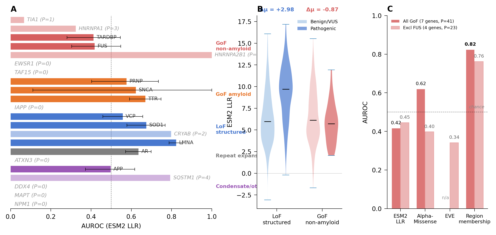
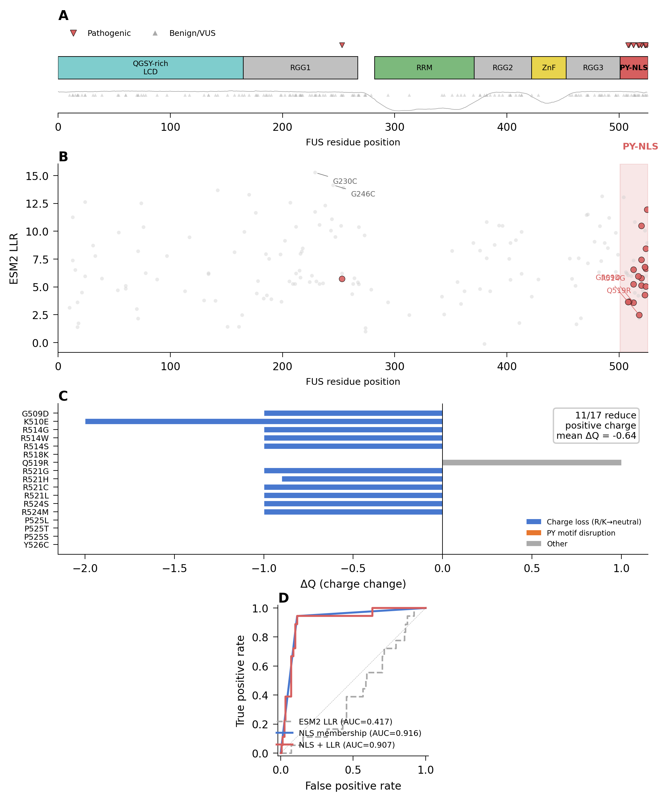
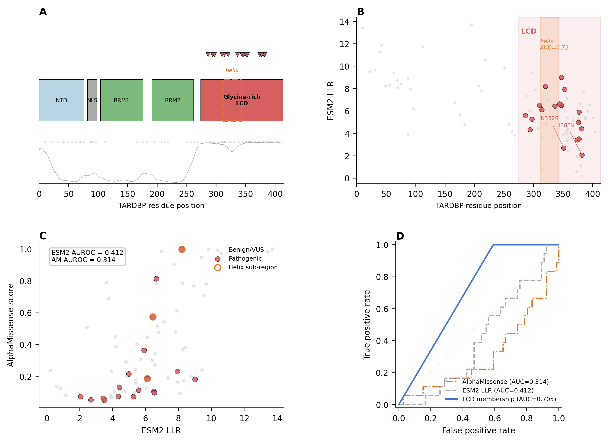
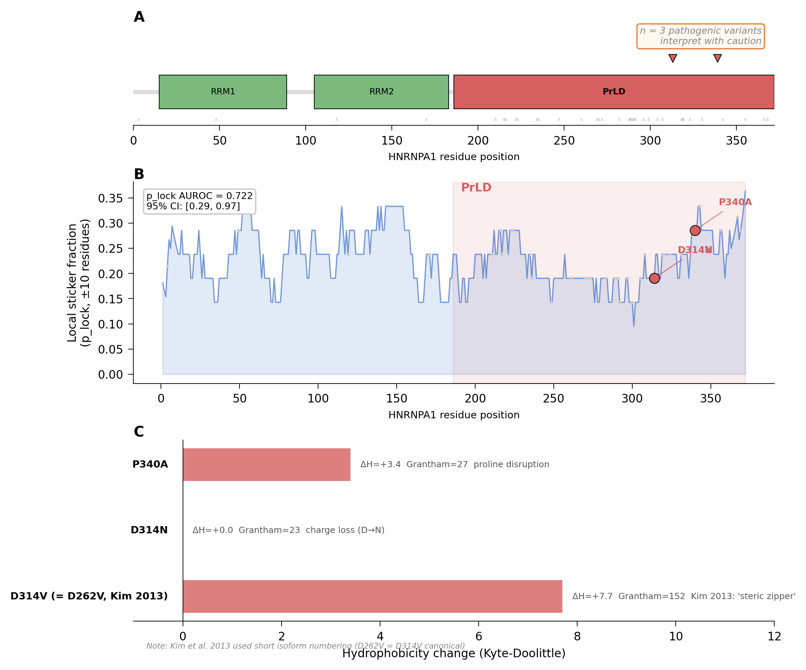
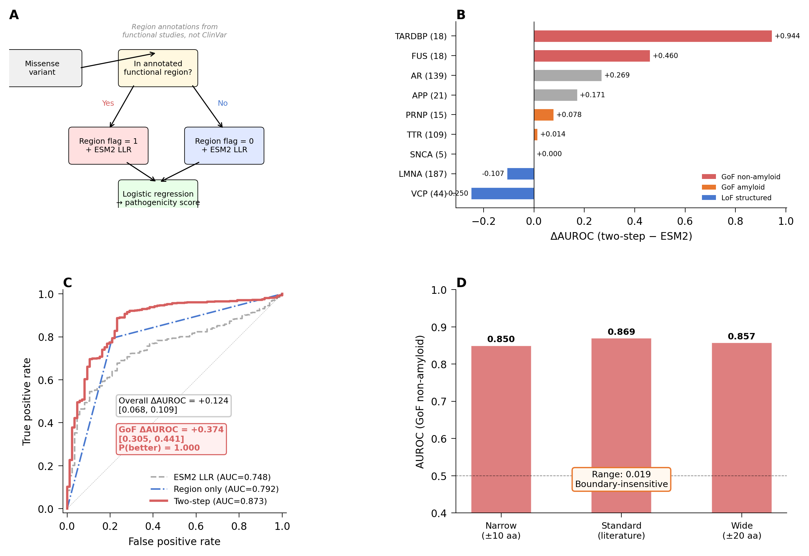
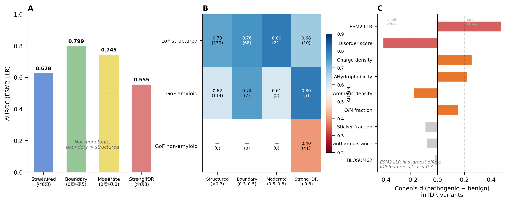

# Verifiable, accountable, and reproducible AI-assisted research: the VAR framework and the AIVS verification schema, demonstrated on an end-to-end protein-variant workflow

**Authors:** Hannah Ribbeck and Boggavarapu Kiran*

**Affiliation:** Department of Chemistry and Physics, McNeese State University, Lake Charles, LA 70609, USA

**Corresponding author:** *Boggavarapu Kiran (kiran@mcneese.edu)

---

## Summary

Generative AI is now embedded in research workflows across the chemical, biological, and data sciences, but editorial oversight has not kept pace. Disclosure statements do not catch the fabricated citations, ungrounded claims, and irreproducible pipelines that AI introduces. We propose VAR (Verifiability, Accountability, Reproducibility) as an operational, enforceable standard for AI-integrated publication, and AIVS, an open-source verification schema that implements it at submission and review; together they form the AIVS-VAR method. We demonstrate the method on a complete AI-assisted workflow: disease-mechanism prediction for intrinsically disordered protein genes using six generative-AI-derived variant predictors across 3,409 ClinVar variants. Applied prospectively during manuscript preparation, manual verification audits — captured as records against the AIVS schema — caught five categories of failure, from fabricated model features to leaked cross-validation labels, that disclosure-only review would have missed. We argue that VAR-compliant publication is achievable, auditable, and editorially enforceable, and is the precondition for AI-integrated science to remain accountable.

## The bigger picture

Scientific publishing runs on a simple assumption: that the words, numbers, and citations in a paper refer to real things, and that named people stand behind them. Generative AI breaks that assumption. It can produce fluent text, plausible citations to papers that were never written, and statistics that look right but trace to nothing, at a scale and speed no reviewer can manually check. Most journals have responded by asking authors to disclose that AI was used. Disclosure verifies nothing; it shifts the problem to the reader.

We argue that AI-assisted research needs an enforceable standard, not a disclosure habit, and supply one. It rests on three checkable properties: every claim and citation resolves to a real object (verifiability), a specific person is on record for each decision (accountability), and the workflow can be independently rerun (reproducibility). A companion open-source schema turns these properties into mechanical checks a submission system can run. Although demonstrated here on a protein-variant prediction pipeline, the same checks apply wherever AI drafts text, writes analysis code, or generates figures, and they matter most for the emerging "AI scientist" platforms that compose thousands of AI steps into results no human fully inspects. A verification record then travels with each paper, lets readers audit how AI-generated content was checked, and survives independent of any vendor. The alternative, a literature in which fabricated and genuine content cannot be told apart, is not a stable foundation for a field built on shared trust.

**Keywords:** generative AI, scientific integrity, reproducibility, intrinsically disordered proteins, AI verification, peer review

---

## 1. Introduction

Generative AI has crossed a threshold in the chemical, biological, and data sciences. Diffusion models design molecular scaffolds with experimental validation against multidrug-resistant pathogens [1]. Transformer-based protein language models generate sequences with native-like topologies that fold to predicted structures [14]. AlphaFold2 and successors recast protein structure prediction from a decades-long bottleneck to a routine preprocessing step [23]. Generative pipelines now operate inside enzyme engineering campaigns, identifying variant landscapes that prioritize wet-lab characterization [2]. Synthetic data generation augments under-powered measurement sets for clinical biosignal modeling, with formal validation against original distributions [3]. Process intensification studies use generative models to expand design spaces for distillation column geometry and decentralized chemical operations [4]. AI tools have entered the teaching of mechanistic chemistry, with curated podcast generation now serving as auxiliary instructional material [5]. The trajectory across these applications is consistent: AI is integral to scientific workflows, not an external accessory to them. As of 2026 these workflows are being consolidated into integrated agentic research suites that ship from major laboratories with reported preclinical validation of AI-proposed candidates [25, 17], yet verification within those suites is performed internally and at design time, not in a tool-agnostic, retrospective form an independent reviewer can re-run against a finished manuscript.

This integration has outpaced the editorial frameworks meant to govern it. Funder policies have responded with blanket restrictions: the National Institutes of Health, in NOT-OD-25-132, will not consider grant applications "substantially developed by AI" after September 2025 [6]. Major publishers require disclosure of AI use but rarely specify what disclosure means, how it is verified, or who is responsible when verification fails [7,8]. Conference venues have alternately banned, permitted, and re-permitted AI assistance in successive policy cycles without converging on operational standards [9]. Governance has intensified in parallel: a 2026 AAAS letter and an April 2026 U.S. House Committee on Science, Space, and Technology hearing on scientific publishing foreground paper mills, reproducibility, and AI misuse [26], and publishers now deploy automated pre-publication screening across thousands of journals [27], but these measures target ethics-policy breaches and fraud, not a workflow-level account of how AI shaped a specific result. The result is a publishing environment in which AI use is widespread, disclosure is inconsistent, and the failure modes that AI introduces are addressed reactively, manuscript by manuscript, after they appear in print.

The relevant failure modes are specific and well documented. Large language models fabricate citations to nonexistent papers, generate plausible quotes from real authors who never wrote them, produce statistically reasonable but biologically meaningless numerical claims, and lend rhetorical fluency to inferences that the underlying data does not support [10,11]. AI-generated figures have been retracted from peer-reviewed venues, including high-visibility cases involving anatomically impossible images and falsified molecular structures [12]. Code generated by AI assistants runs successfully against unit tests but fails silently on edge cases that the human author did not anticipate [13]. None of these failures is captured by a disclosure statement alone. Each requires verification: checking the citation against the cited paper, checking the quote against the source, checking the figure against the data, running the code against the actual problem.

The trajectory is accelerating in a direction the framework must address directly. End-to-end agentic AI platforms (Google DeepMind's Co-Scientist [17], FutureHouse's Robin [18], Edison Scientific's Kosmos [19], and Sakana's AI Scientist [20]) now compose hundreds of generative invocations into single user-facing research outputs. Co-Scientist organizes six specialized Gemini-based agents (generation, reflection, ranking, evolution, proximity, meta-review) into a tournament-evolved hypothesis pipeline that has been used to propose drug-repurposing candidates with subsequent wet-lab validation. Robin orchestrates literature-review, candidate-evaluation, and data-analysis agents into a closed loop and produced, end-to-end, a *Nature*-published claim that the ROCK inhibitor Y-27632 augments retinal pigment epithelium phagocytosis as a candidate therapeutic for dry age-related macular degeneration. Kosmos runs twelve-hour autonomous research campaigns, executing approximately 42,000 lines of code and reading 1,500 papers per run across roughly 200 agent rollouts. The AI Scientist produced, in 2025, the first fully AI-generated paper accepted through peer review at an ICLR workshop, with the underlying methodology since published in *Nature*. These outputs are entering the published record now. The verification gap is documented quantitatively: a failure-mode taxonomy of fabricated citations at NeurIPS 2025 identified 100 hallucinated references across 53 accepted papers that had each passed three-to-five-reviewer expert scrutiny [24]; the SPOT benchmark of 83 published papers paired with 91 errata-level errors found state-of-the-art LLMs detect such errors at 6.1% precision and 21.1% recall [11]; an independent evaluation of one autonomous platform on three radiation-biology problems yielded one well-supported discovery, one ambiguous result, and one demonstrably false hypothesis [21]. None of these failures was caught by disclosure-only review.

Existing publication norms were calibrated for a world in which fabrication required deliberate effort. That assumption no longer holds. Plausible scientific text can be generated at scale, on demand, in any voice, with citations that look like real citations and arguments that look like real arguments. The defenses that scientific publishing has historically relied on (peer review by domain experts, editorial judgment, the implicit assumption that authors stand behind their words) were not designed for an environment in which authors may not have written most of what they signed.

We argue that AI-integrated science requires an explicit, operational, enforceable framework that addresses these failure modes directly. We propose three principles (verifiability, accountability, and reproducibility) that together constitute such a framework, and we name the framework VAR. The three principles target distinct failure modes and form a closed operational loop. Verifiability asks whether the claims in a manuscript refer to real, locatable, accurate objects. Accountability asks who is responsible for specific decisions in the AI-assisted workflow. Reproducibility asks whether an independent researcher can reconstruct and assess the work. None of the three principles is novel in isolation. The contribution lies in making them the explicit basis of editorial decision-making for AI-integrated submissions, and in providing the procedural infrastructure (a verification schema named AIVS, together yielding the AIVS-VAR method) that allows the principles to be enforced consistently rather than aspirationally.

The remainder of this paper develops the VAR framework in detail (Section 2), describes the AIVS verification schema that operationalizes it (Section 3), demonstrates the framework against a complete end-to-end research workflow on intrinsically disordered proteins (Section 4), discusses adoption pathways and limitations (Section 5), and concludes (Section 6).

---

## 2. The VAR Framework

The VAR framework rests on three principles. Each addresses a distinct failure mode of AI-assisted research. Together they constitute the editorial standard we propose for AI-integrated publication.

### 2.1 Verifiability

Verifiability is the requirement that every empirical claim, citation, dataset reference, quoted source, figure, and code block in a manuscript resolve to a real, locatable, accurate underlying object. The principle is operational, not philosophical. A submission is verifiable if its content can be checked against ground truth at the point of submission and review.

The motivation for treating verifiability as a first-order publication standard is specific to AI-assisted writing. Generative models fabricate. They produce citations to papers that do not exist, attribute quotes to authors who did not write them, and assemble statistics from training-data patterns that resemble real numbers without corresponding to real measurements. A recent cross-model audit of ten deployed large language models, spanning four academic domains and 69,557 generated citations, found fabrication rates ranging from 11.4 to 56.8 percent depending on model, domain, and prompt framing [10]. Even careful authors miss fabrications when manuscripts are long and citations are dense; even careful reviewers cannot check every citation manually within the time budget of a review.

The replacement of falsifiability with verifiability as the editorial standard is deliberate. Falsifiability, in the Popperian formulation, is a property that distinguishes scientific from non-scientific claims. It applies most cleanly to hypothesis-testing experimental work and maps awkwardly onto methods papers, structural characterizations, computational tool releases, and taxonomic surveys, all of which routinely appear in chemical and biological journals without losing scientific status. More to the point, falsifiability is not the principle that fails when AI is involved. The principle that fails is the implicit assumption that text in a manuscript refers to real objects in the world. Verifiability addresses that failure directly; falsifiability does not.

Verifiability is enforceable at submission. Citations can be resolved against CrossRef, PubMed, arXiv, and institutional repositories. Quoted material can be checked against the cited source. Data references can be tested for retrievability. Code can be tested for executability. Figures can be analyzed for AI generation and image manipulation. Each check is mechanical; the cost is a one-time investment in tooling rather than an ongoing burden on reviewers. The verification surface that AIVS implements (Section 3) makes these checks systematic rather than incidental.

### 2.2 Accountability

Accountability is the principle that every AI-assisted decision in a research workflow is attributed to a specific responsible human agent. Verifiability is a property of claims; accountability is a property of agents. A manuscript can be verifiable in the sense that its claims resolve to real objects, while still failing to be accountable, in the sense that no human stands behind the inferences drawn from those objects. The two principles are complementary.

AI-assisted research distributes decisions across human and machine agents. A typical generative workflow may involve: an author selecting a prompt; a model producing draft text; an author editing the draft; a second author verifying citations; a code-assistant agent generating analysis scripts; a third author validating the scripts; a model producing a figure; an author approving the figure. Each step represents a decision. Each decision can fail. Without explicit accountability, failures diffuse across the workflow, and no agent, human or machine, is uniquely responsible for any specific output.

The framework requires that AI-assisted submissions identify, in disclosure, which agents are responsible for which decisions. Authors carry final accountability for the manuscript as a whole, regardless of which tools assisted in its preparation; this point is not novel and tracks the existing consensus position across major publishers [7,8]. The VAR framework extends this to internal accountability at the granularity of section and task: which author chose the prompt, which author verified the citations, which author approved AI-generated figures. The disclosure is structured, not narrative, and it is recorded by AIVS as part of the submission package.

Accountability extends beyond authorship. Reviewers carry accountability for the judgments rendered in their reviews; reviews that recommend acceptance of submissions later found to contain unverified fabrications are tracked across the platform and affect future reviewer assignment. Editors carry accountability for the integrity of the review process and for decisions to publish despite flagged verification failures. The mechanism is record-keeping, not punishment. The platform retains a log of decisions; consequences attach to systematic patterns, not isolated incidents.

Accountability achieves what falsifiability does not. Falsifiability concerns whether a claim could in principle be disproved. Accountability concerns whether someone is on record as responsible for the claim having been made in the first place. In an environment where claims can be generated mechanically, the latter is the more pressing standard.

### 2.3 Reproducibility

Reproducibility, the third leg of the framework, requires that the workflow producing a published result can be independently reconstructed by a competent researcher. The principle is established in scientific practice and predates AI integration; the framework extends it to cover AI-specific elements that older reproducibility standards did not address.

A submission is reproducible under VAR if it discloses: the data inputs (with retrievable identifiers or full deposition); the analysis code (with version control and dependency manifests); the AI tools used (with model identifiers, versions, and access dates); the prompts where prompts substantively shaped output (with full text or templates); the model parameters and stochastic seeds where relevant; the human verification steps that intervened between AI output and final claim; and the validation procedures applied to AI-generated content before its incorporation into the manuscript.

Reproducibility does not require bit-for-bit reproduction. Stochastic generative models, proprietary tool APIs that change without notice, and inference-time variation across hardware all make exact reproduction impossible for many AI-assisted workflows. The framework requires functional reproducibility: enough disclosure that an independent researcher can rerun the workflow, obtain results that fall within the expected variation range, and assess whether departures from published results indicate methodological error or expected stochastic noise. Where full openness is constrained by privacy, security, or contractual limits, the constraint must be declared and the validation path explained. A submission that runs entirely on a proprietary model with no public API documentation is not reproducible; this is a hard constraint rather than a soft preference.

For AI-assisted work specifically, reproducibility includes the verification record itself. A reproducible submission discloses both how the work was done and how its AI-generated components were checked. The verification log (which citations were resolved against which sources, which figures were forensically analyzed, which code blocks were executed against which test cases) is part of the reproducibility envelope. Other researchers should be able to inspect the verification trail and confirm that the checks were performed.

### 2.4 The triad as a closed loop

The three principles are not interchangeable and not stackable. They form a closed operational loop, and removing any one breaks the framework.

Verifiability without accountability is mechanical. A pipeline that checks every citation against CrossRef and every figure for AI generation will catch some failures, but it cannot adjudicate ambiguous cases: partial citations, paraphrased quotes, novel results that lack a literature anchor. Human judgment is required to interpret verification output, and accountability assigns that judgment to specific agents. A purely automated verification system without human accountability is a vending machine for false-positive and false-negative classifications.

Accountability without verifiability is performative. Authorship declarations and AI-disclosure statements signal intent without checking output. A manuscript may attribute its citation verification to a specific co-author who, in turn, may have used an AI tool to perform the verification, which may have hallucinated a confirmation. Without an independent verification surface, accountability statements describe a process that may or may not have occurred.

Reproducibility without verifiability or accountability is documentation. A submission may publish every prompt, every model checkpoint, every parameter, every seed, and still report results based on fabricated underlying data. The reproduction would faithfully replicate the fabrication. Reproducibility alone does not distinguish genuine from spurious findings; it only ensures that what was done can be redone.

The three principles together address what each alone cannot. Verifiability checks that claims refer to real objects. Accountability assigns responsibility for the claims and the verification. Reproducibility ensures that the work can be independently assessed against the verification record. Each principle is necessary; none is sufficient.

---

## 3. AIVS: A Verification Schema for AI-Assisted Submissions

### 3.1 Generative AI is a system-of-tools, not a tool

Established scientific instruments are *tools*. A spectrometer is one tool. A pulse-acquired NMR experiment is fully specified by the spectrometer model, field strength, probe, pulse sequence, acquisition parameters, sample preparation, solvent, and processing software. The documentation conventions are established; the failure modes are bounded by instrument calibration. A spectroscopist does not report "I used NMR." They report instrument, sequence, solvent, concentration, processing software, and assignment logic. The granularity of disclosure tracks the granularity at which the method can fail.

Generative AI differs in kind. A single nominal AI-assisted task (drafting a paragraph, generating a figure, suggesting an enzyme variant) is the composition of a model choice, a model version, a prompt, a system message, sampling parameters such as temperature and seed, retrieval scaffolding where relevant, agentic tool-use where relevant, post-processing, and human editing. Any of these can independently change the output. The same nominal tool produces different outputs across calls. Models update under their identifiers; system messages are usually undisclosed; sampling parameters often go unrecorded; the chain of edits between raw output and committed text is invisible to readers. A flat disclosure line ("AI was used in manuscript preparation") discloses nothing at the granularity at which AI-assisted methods actually fail.

A generative AI workflow is a *system* of these elements. Verification at the system level requires documentation at the system level, and current scientific publishing has none. AIVS is the documentation schema for this system. It specifies the records, the relations between records, and the verification surface against which the records are checked at submission. Its scope is the AI-assisted workflow specifically; it does not propose new standards for non-AI work because no analogous documentation gap exists in those domains. The MIBBI family of minimum-information standards (MIAME for microarray experiments, MIQE for quantitative PCR, ARRIVE for animal research, and successors) provides the precedent. AIVS is to generative AI in science what those standards are to their respective tool-systems: a vocabulary that makes implicit documentation explicit and reviewable.

Existing AI-reporting standards do not fill this gap. TRIPOD-AI, CONSORT-AI, CLAIM, and DOME are minimum-information standards for *discriminative* machine learning: a model predicts a label, and the standards specify how to report the prediction task and its evaluation. None addresses the *generative* loop in which output is composed across iterations, edited by humans, and curated before deposition. AIVS extends the minimum-information tradition to cover this gap. A manuscript reporting AI-assisted clinical-imaging work satisfies both CLAIM (model-level reporting) and AIVS (workflow-level reporting); the two are orthogonal.

The argument intensifies for the class of end-to-end agentic AI platforms now producing peer-reviewed publications [17, 18, 19, 20]. A single user-facing invocation of such a platform expands internally into tens to hundreds of generative sub-invocations across literature search, hypothesis generation, code synthesis, data analysis, and manuscript writing, each with its own model identity, parameters, and outputs. A disclosure line stating that "an AI co-scientist was used" captures none of the relevant granularity. AIVS handles this case by construction: the parent_invocation_id field of the Invocation record chains sub-invocations into a directed graph that documents the workflow at its actual decomposition. The schema does not require platforms to surface their internal records publicly; it requires that the records of invocations contributing to published claims be reconstructible at the granularity at which those claims could have failed.

### 3.2 The generate–evaluate–iterate–curate–deposit loop

Generative AI use in scientific publication follows an invariant workflow. A source is supplied: a dataset, a text corpus, a protein sequence, a research question. A generative tool is invoked on that source under chosen parameters. The output is evaluated against criteria appropriate to the task. Where evaluation reveals inadequacy, the invocation is repeated with modifications: a refined prompt, a different model, an adjusted temperature, a corrected source. Output that passes evaluation is curated (selected, edited, ordered) for inclusion in the final work. The curated artifact is deposited in a public record. We refer to this sequence as the *generate–evaluate–iterate–curate–deposit* loop.

The loop is invariant across the range of generative-AI applications now appearing in scientific publication. Smith's generation of an educational podcast on organic reaction mechanisms [5] traverses the loop: source material (his published paper), generation (NotebookLM audio output across three versions), evaluation (author identification of technical errors), curation (Audacity splicing of the best segments), deposition (transcripts in supplementary information and the final podcast on a public video platform). The Li et al. virtual evolution of CYP2C9 variants [2] traverses the loop: source (deep-mutation-scanning data), generation (VERnet predictions and AlphaFold3-refined predictions), evaluation (computational benchmarks against held-out variants, and molecular dynamics simulations of selected candidates), curation (selection of variants for in vitro testing), deposition (model, code, and assay outcomes in a public repository). Sharma et al.'s synthetic biosignal generation [3], Montesinos-Castellanos et al.'s generative process intensification [4], and the IDP workflow of Section 4 all traverse the same loop. The structural identity is not coincidental. The loop encodes the basic shape of any workflow in which a generative system produces output that human investigators must evaluate, edit, and certify before publication.

AIVS documents the loop. The schema specifies five record types (Source, Invocation, Evaluation, Curation, Deposition), each attached to a stage of the workflow. A complete AIVS bundle records what entered the workflow, what each AI invocation produced under what parameters, how each output was evaluated, which outputs were retained for downstream use, and where the artifact was finally deposited. The bundle is the documentation of the loop's traversal: a structured record from which a reader can reconstruct what the AI did, what was checked, what was kept, and who is accountable for each decision.

### 3.3 Record types and relations

AIVS is layered. The released v0.1.0 ships a generic *kernel* of records — Event, Evidence, Decision, Claim, Actor — sufficient to capture any audited workflow at the granularity of decisions and the evidence chains that support them. This section defines the *application vocabulary* — Source, Invocation, Evaluation, Curation, Deposition — that v1.0 lifts on top of the kernel, specialized to the generate–evaluate–iterate–curate–deposit loop of AI-assisted research. The application vocabulary maps deterministically into the kernel: an Invocation is encoded as an Event whose Actor is the AI tool and whose target is the model-version triple; an Evaluation is encoded as an Event whose Actor is the verifier (human or automated) and whose target references the Invocation's output; a Curation is encoded as a Decision whose evidence chain selects the kept Invocations; Source and Deposition are encoded as Events with SourceRef anchors. The case-study artifact (§4) is currently encoded directly in the kernel at workflow-decision granularity; v1.0 surfaces the application vocabulary in the editorial-facing view without changing the underlying records.

The five AIVS application-vocabulary record types are defined as follows.

**Source records** describe inputs to the workflow. A Source record carries an identifier, a type (dataset, document, sequence, image, prompt-template, prior work), a resolvable URI, a content hash, a retrieval timestamp, and a license. The Source record is the workflow's epistemic anchor: any AI-generated content that cannot be traced through Invocations back to a Source has no documented provenance. Source records may themselves be AI-generated artifacts from earlier work, in which case their AIVS deposition URIs are resolved transitively.

**Invocation records** describe each call to a generative tool. An Invocation record carries an identifier, an optional parent_invocation_id linking it to a predecessor in an iteration chain, the tool, the model, the model version or weights hash, the full prompt and system message, sampling parameters (temperature, top-p, seed, max-tokens, and any tool-specific parameters), the response, the operator's ORCID, an access timestamp, the provider's stated retention policy at access date, and a purpose annotation describing what the invocation was intended to produce. Iteration is encoded by the parent_invocation_id field: each successive invocation in a refinement chain points to its predecessor. The graph of Invocation records is the iteration history of the workflow.

**Evaluation records** describe checks performed on Invocation outputs. An Evaluation record carries an identifier, a reference to the Invocation it evaluates, a check type drawn from a controlled vocabulary (citation_resolution, quote_match, data_retrievability, code_execution, benchmark_comparison, experimental_validation, image_forensic, semantic_audit), a specific target within the Invocation output, a result (pass, fail, or ambiguous, with a confidence value), the verifier (a human ORCID for manual checks, an automated-tool identifier for mechanical checks), and a URI to the evidence supporting the result. A single Invocation may have many Evaluation records attached, performed by different verifiers using different check types. The Evaluation record is the explicit verification trail that V in VAR requires.

**Curation records** describe human selection from AI output. A Curation record carries an identifier, references to the source Invocations from which content was drawn, a description of what was kept (boolean for whole-output selection, or a list of identifiers for partial selection such as line ranges, frame indices, sentence positions, or citation slots), a rationale, and the accountable author's ORCID. The Curation record is the auditable trace from raw AI output to manuscript content: it answers the question of which AI-generated material entered the paper and who decided to keep it. It is also where A in VAR is operationalized: every retained fragment carries the ORCID of the human who certified its inclusion.

**Deposition records** describe public placement of the final artifact. A Deposition record carries an identifier, the artifact type, a resolvable URI, the repository, a DOI where assigned, a version, a license, and the provider retention policy at access date. The retention-policy field acknowledges that AI providers retain logs under their own changing policies, which authors do not control; the schema records the provider's stated policy at the time of access rather than asserting an assurance the author cannot give.

The relations among records form a directed graph rooted at Source records and terminating at Deposition records. Source records feed Invocations. Invocations chain via parent_invocation_id, producing the iteration graph. Each Invocation may have many Evaluations attached. Curations draw selectively from one or more Invocations. Depositions register the curated artifact in a public record. Every record carries an accountable_author ORCID identifying the human responsible for that step. The graph is the complete trail; AIVS records are its nodes.

**Table 1.** AIVS record types, workflow stage, key fields, and typical cardinality per manuscript.

| Record | Workflow stage | Key fields | Cardinality |
|---|---|---|---|
| Source | Source | id, type, uri, content_hash, retrieved_at, license | One or more per workflow |
| Invocation | Generate | id, parent_id, tool, model, version, prompt, parameters, response, operator, access_date, retention_policy, purpose | One per AI call |
| Evaluation | Evaluate | id, invocation_ref, check_type, target, result, confidence, verifier, evidence_uri | Many per Invocation |
| Curation | Curate | id, invocation_refs, kept, rationale, accountable_author | One or more per workflow |
| Deposition | Deposit | id, artifact_type, uri, repository, doi, version, license, retention_policy | One per published artifact |

The schema is serialized as JSON; the canonical v0.1.0 schema definition is deposited at https://github.com/khatvangi/aivs (kernel record types) and the v1.0 application-vocabulary specification is staged for release at the same repository under tag v1.0. Record interchange between submission platforms uses the deposited schema as the contract.

### 3.4 The verification surface at submission

AIVS v1.0 specifies the verification checks an AIVS-compliant submission platform performs automatically on every AI-assisted submission. The v0.1.0 release defines the schema against which check outputs are recorded as Evaluation records (kernel-level Events with verifier Actors and check-type targets); the implementation of the checks themselves is staged as adapter and parser releases (see §3.7). In what follows, present tense refers to the v1.0 target behaviour of the verification surface. The checks operate on the Evaluation records in the bundle and on the artifacts they reference, and are bounded by what can be mechanically verified. The submission is not rejected automatically on failure; the verification report is attached to the submission and routed to editors and reviewers as part of the review record.

*Citation resolution* checks every reference in the manuscript against CrossRef, PubMed, arXiv, and configured institutional repositories. Each citation is resolved to a DOI or persistent identifier; failed resolutions are flagged with the manuscript location and the attempted resolution targets. Partial matches (correct author, wrong year; correct title, wrong author) are flagged separately from non-resolutions.

*Quote matching* checks every quoted passage in the manuscript against the source identified in the corresponding citation. Where the source is open-access, the match is performed against the full text. Where the source is paywalled, the match is performed against the abstract and the manuscript record where AIVS has API access; otherwise, the quote is flagged for manual reviewer check. The check tolerates standard paraphrase but flags exact-quotation marks whose content is not present in the cited source.

*Data retrievability* checks every dataset reference. Repository identifiers are resolved; access is confirmed; embargoed deposits are flagged with the embargo expiry date. Inaccessible datasets are flagged as reproducibility blockers and routed to the editor.

*Code execution* checks every code repository referenced in the manuscript. The repository is cloned, dependencies are resolved against the deposited environment manifest, and a minimal smoke test is executed where the authors have provided one. Failures are reported with stack traces. The check does not run full pipelines, which is the authors' responsibility to test; it verifies that the deposited code is executable in the deposited environment.

*Image forensic analysis* checks every figure for indicators of AI generation and image manipulation. Existing forensic tools (Bik-style audit pipelines, ImageTwin, Proofig, and successor systems integrated under a common API) generate provenance scores and manipulation flags. AIVS aggregates these into a single forensic record attached to each figure.

*Schema validation* checks that the AIVS bundle is well-formed: every Curation references a real Invocation; every Invocation has at least one Evaluation if its output appears in the manuscript; every Deposition resolves to a public URI; every accountable_author ORCID is verified; every Source has a retrievable URI or a documented redaction.

The verification surface is intentionally bounded. AIVS does not assess the scientific correctness of claims, the appropriateness of methods, the novelty of contributions, or the quality of writing. These remain the responsibility of human reviewers. AIVS removes a category of failures (citation hallucination, ungrounded quotation, irretrievable data, broken code, image fabrication) from the reviewer's burden. It does not remove the reviewer.

**Table 2.** AIVS submission-time verification checks, the failure mode each addresses, and the reviewer judgment that remains.

| Check | Failure mode addressed | Reviewer judgment retained |
|---|---|---|
| Citation resolution | Hallucinated references | Whether cited work supports the claim |
| Quote matching | Misattributed or invented quotations | Whether quoted material is interpreted accurately |
| Data retrievability | Phantom datasets | Whether data is sufficient for the claim |
| Code execution | Non-runnable analysis | Whether code implements the described method correctly |
| Image forensic analysis | Fabricated or manipulated figures | Whether figures support the textual claims |
| Schema validation | Incomplete provenance | Whether the documented workflow is appropriate |

### 3.5 Privacy, redaction, and access control

Several categories of legitimate scientific work cannot disclose AI invocations in full at submission. Prompts may contain unpublished data, patient-derived identifiers, third-party intellectual property, or material covered by institutional review board restrictions. Full prompt deposition without modification is incompatible with HIPAA, GDPR, and standard IRB protocols. AIVS handles this through a tiered disclosure model rather than a blanket requirement.

The schema distinguishes three disclosure tiers per record. *Public* records are deposited in the AIVS bundle with full content, openly accessible alongside the published manuscript. This is the default for non-sensitive work and the floor for all submissions on a defined subset of fields: model identifiers, model versions, sampling parameters, verification results, and accountable-author ORCIDs are always public regardless of tier. *Editorial* records are deposited in full but accessible only to editors and assigned reviewers during the review process; the public bundle records the existence of the editorial-tier record and the rationale for restricted access, but not the content. *Redacted* records are deposited with sensitive content removed under a documented redaction methodology; the redaction methodology itself is public, and the redacted content is held under access controls appropriate to the underlying restriction (IRB approval letters, data-use agreements, or equivalent). The schema records the tier, the rationale, and where applicable the redaction methodology.

Authors elect the tier per record at submission, subject to the floor constraint. Editorial discretion applies: editors may require demotion to a stricter tier where the disclosed material itself raises concerns, or promotion to a more open tier where the claimed sensitivity is not substantiated. The audit trail of tier elections and editorial overrides is recorded.

Provider-side retention is recorded but not asserted. AIVS captures the provider's stated retention policy at the time of access for each Invocation; this is the field the author can supply truthfully without claiming control over data the author does not control. Where the provider's policy changes after access, the original recorded policy stands as the provenance claim for that Invocation.

Chat-log deposition is bounded to *invocations that contributed to published claims*, not full session histories. Authors retain the right to keep exploratory invocations, false starts, and abandoned threads outside the AIVS bundle. The schema enforces only that every Invocation referenced by a Curation appears in the bundle and that the referenced output matches the curated content within the schema's tolerance. False starts that produced no curated output do not enter the record.

**Table 3.** AIVS disclosure tiers, access scope, and floor fields.

| Tier | Public access | Editorial/reviewer access | Floor fields (always public) |
|---|---|---|---|
| Public | Full record content | Full record content | Model ID, version, parameters, verification results, accountable_author |
| Editorial | Existence and rationale only | Full record content | As above |
| Redacted | Redaction methodology only | Redacted content under controlled access | As above |

### 3.6 The accountability log

AIVS records persist beyond submission. The accountability log retains author attributions, reviewer assignments, reviewer judgments, editorial decisions, and post-publication verification events for the lifetime of the published record. The log is appended to, not overwritten: a verification re-run against an updated database that newly resolves a previously-failed citation is recorded as a new Evaluation, leaving the original failure visible in the audit trail.

The log enables three operational uses. First, post-publication verification by readers and downstream researchers, who can re-run AIVS checks against the published bundle and compare results to the publication-time verification. Second, editorial decisions on related submissions: a corresponding author whose prior submissions cleared review on the strength of verification claims later contradicted by post-publication evidence is flagged for stricter editorial scrutiny on future submissions. Third, reviewer assignment: reviewers whose recommendations diverge systematically from post-publication verification outcomes are weighted accordingly in future assignments. The mechanism is record-keeping, not punishment; consequences attach to systematic patterns across multiple manuscripts, not to isolated incidents.

### 3.7 Implementation and interoperability

AIVS is released under AGPL-3.0-or-later at https://github.com/khatvangi/aivs. The released v0.1.0 ships the meta-schema (the kernel record types of §3.3), the JSON serialization specification, structural-integrity validation, the redact-by-default privacy posture of §3.5, and four worked retrospective audit examples (the case study of §4 plus three prior workflows on protein-design and educational-content paper preparation). The verification checks of §3.4, the application-vocabulary serializer that surfaces Source/Invocation/Evaluation/Curation/Deposition records over the kernel, the manuscript parser, and the API for submission-platform integration are staged for v0.2 through v1.0; adapters for the major submission systems (ScholarOne, Editorial Manager, OJS, and successors) are roadmap items implementable against the released schema, and the schema's stability across these releases is guaranteed by the v0.x meta-schema versioning. Deployment at a venue, once the v1.0 surface ships, requires integration work scaled to the venue's existing submission infrastructure, not greenfield development.

Adapter integration extends to AI platforms that produce structured workflow records of their own. Several current end-to-end agentic systems [17, 18, 19] emit internal logs that link individual statements in their reports to source code or primary literature. These platform-specific logs can be exported to AIVS Invocation, Evaluation, and Curation records via reference adapters maintained alongside the core schema. The adapter pattern preserves AIVS as the editorial-facing record while accommodating heterogeneous internal representations across providers.

Interoperability with existing minimum-information standards is preserved. AIVS records may carry external schema references (a CLAIM checklist for a clinical-imaging submission, a TRIPOD-AI declaration for a discriminative-ML submission, an ARRIVE compliance statement for animal-research components) without conflict. AIVS documents the AI workflow; the external standards document their respective tool-systems; the records coexist in the same bundle.

The schema is versioned. Backward compatibility is guaranteed within major versions; major-version transitions are accompanied by migration tooling. The current specification is AIVS v0.1; the version under which a given manuscript was submitted is recorded in the bundle metadata and pinned to the published record.

### 3.8 What AIVS does not do

AIVS does not certify scientific correctness. A manuscript whose every citation resolves, every quote matches, every dataset is retrievable, every code block executes, every figure passes forensic analysis, and every Curation is attributed may still report wrong conclusions from misinterpreted evidence. The schema removes mechanical failures from the review surface; it cannot replace the judgment of domain experts.

AIVS does not regulate AI authorship. The schema assigns accountability to human ORCIDs; whether an AI agent is eligible for authorship credit is a separate question on which the framework takes no position.

AIVS does not address dual-use governance. The schema is silent on whether a particular AI-assisted workflow should have been undertaken; it documents what was undertaken once that decision has been made. Biosecurity and dual-use restrictions operate at a layer above the schema and remain the province of institutional review and funder policy.

AIVS does not eliminate the verification cost. It concentrates verification at predictable workflow points, mechanizes the checks that can be mechanized, and produces a record that downstream readers can audit. Authors invest time at submission; reviewers save time during review; readers gain a verification trail that previous publication models did not provide. The framework's claim is that this redistribution is favorable, not that verification becomes free.

---

## 4. Case Study: An End-to-End AI-Assisted Workflow on IDP Disease Mechanism Prediction

We demonstrate the AIVS-VAR method against a complete research workflow on intrinsically disordered protein (IDP) disease variants. The choice of IDP variant interpretation is deliberate. IDP-associated genes are clinically important (FUS, TARDBP, HNRNPA1, MAPT, SNCA, TTR, LMNA, SOD1, and related loci together account for a substantial fraction of inherited neurodegeneration and amyloid pathology), and they are exactly the class of genes where conservation-based variant predictors are reported to underperform. The workflow studied here uses six independent generative-AI-derived predictors (ESM2, AlphaMissense, EVE, CADD, REVEL, PolyPhen-2) to quantify that underperformance across disease mechanisms and to test whether functional-region context can recover predictive signal where conservation fails. The scientific finding is mechanism-dependent and conditional rather than universal; it is exactly the class of claim most vulnerable to drift under disclosure-only review.

### 4.1 The research workflow

The biological question is whether conservation-based pathogenicity predictors handle missense variants in IDP-associated genes uniformly across disease mechanisms. The workflow integrates: (i) curation of a clean-labeled variant dataset from ClinVar; (ii) per-variant scoring with six independent generative-AI-derived predictors; (iii) leave-one-gene-out cross-validation of a two-step model combining curated functional-region context with the ESM2 log-likelihood ratio; (iv) mechanism-stratified evaluation against bootstrap and permutation controls; and (v) AI-assisted manuscript preparation, including literature synthesis, methods drafting, and figure generation under the verification protocol of Section 3.

The dataset comprises 4,011 missense variants across 23 IDP-associated genes drawn from the ClinVar February 2026 snapshot at ≥1-star review status, cross-validated against UniProt canonical sequences (94.7% position-match rate; MAPT 17% and HNRNPA2B1 14% reflect isoform mismatches and are flagged accordingly). After excluding variants with conflicting clinical interpretations and the HTT locus (excluded on grounds described in §4.2), the evaluable set comprises 3,409 variants across 22 genes. The clean-label primary set, restricting to confirmed pathogenic (P + LP) versus confirmed benign (B + LB) labels, contains 778 variants across 14 evaluable genes; the VUS-included sensitivity set contains 3,102 variants with VUS proxied as non-pathogenic.

The generative-AI components are these. ESM2 (esm2_t33_650M_UR50D, 650-million-parameter protein language model) [14] supplies per-position log-probabilities from which the variant log-likelihood ratio (LLR), the WT and mutant log-probabilities, the position-level entropy across the twenty amino acids, and the ranks of WT and mutant residues are computed. AlphaMissense [15] and EVE [16] supply variant pathogenicity scores from independent generative architectures: AlphaMissense built on AlphaFold2 structural features and trained on population-frequency proxies, and EVE built on variational autoencoders trained over deep multiple-sequence alignments. CADD, REVEL, and PolyPhen-2 are included as established baselines that do not use generative-AI architectures but enter the six-predictor convergence analysis. The downstream classifier is an XGBoost model (200 trees, depth 4, class-weighted) trained on a 27-feature handcrafted set covering local sequence composition, disorder, maturation grammar, and mutation chemistry; the canonical paper-facing model is the two-step logistic regression combining a binary curated-region-membership indicator with the raw ESM2 LLR. AI assistance was additionally used in the literature synthesis underlying the introduction and discussion, in initial drafting of methods text, and in generation of figure code from result tables.

The workflow maps onto the AIVS generate–evaluate–iterate–curate–deposit loop directly. Source records anchor the ClinVar snapshot (with content hash), the UniProt canonical sequences, and the functional-region annotations drawn from Dormann et al. 2010 (FUS PY-NLS, residues 502–526), Conicella et al. 2016 (TARDBP LCD, residues 274–414), and Kim et al. 2013 and Gui et al. 2019 (HNRNPA1 PrLD, residues 185–372). Invocation records cover each ESM2 inference call, each AlphaMissense and EVE lookup with access date and provider retention policy, each XGBoost training fold, and each AI-assisted drafting and figure-generation session. Evaluation records cover LOGO-CV AUROC computation, bootstrap confidence intervals over 1,000 resamples, 10,000-permutation random-region control, mechanism-stratified subgroup AUROCs, per-gene permutation tests, and the six-predictor convergence analysis. Curation records identify the canonical paper-facing outputs (the two-step predictor table, the mechanism-split table, the per-gene tables, the bootstrap CI table, the predictor comparison tables) and explicitly mark exploratory analyses (the oracle-routed mechanism-aware ensemble of script 08, the early ML approaches of scripts 04 and 06) as superseded. Deposition records cover the six main figures (figure_1 through figure_6), the seven supplementary figures (figure_s1 through figure_s7), the canonical CSV tables, the analysis scripts (22 in `scripts/mutation/`, 14 in `scripts/figures/`), the pinned ClinVar snapshot, the environment manifest, and the Claude Code session JSONLs. The v0.1.0 artifact deposited with this manuscript encodes the loop in the kernel at workflow-decision granularity — three workflow Decisions (dataset curation, six-predictor selection, canonical-model selection) plus five failure-disposition Decisions (one per category in §4.2), each linked to Events citing the implementing code, the audit documents, and the canonical CSV outputs — with per-invocation granularity over the AI calls deferred to the v1.0 application-vocabulary serializer.

### 4.2 What AIVS-VAR caught during workflow preparation

The case study is informative principally because AIVS-VAR was applied prospectively during manuscript preparation rather than retrofitted afterwards. The verification surface caught five categories of failure that would have entered the literature under disclosure-only review. Each is documented as an Evaluation record in the AIVS bundle and corrected in the canonical outputs.

**Fabricated default features from a context-window violation.** The HTT locus encodes a 3,142-residue protein. ESM2's 1,022-token context window is exceeded by HTT sequences, and the inference wrapper in an early analysis script silently returned default-valued features (llr = 0.0, entropy = 0.0, rank = 10) for variants whose surrounding context could not be tiled within the window. 170 of 259 HTT variants (65.6%) received these fabricated defaults and were initially included in pooled AUROC computations. A manual data-retrievability audit on the variant feature table — checking for identical default-value patterns across consecutive variant positions, a signature of fabricated rather than computed features — flagged the HTT rows. The flag and its disposition are recorded as a kernel-level Decision in the AIVS bundle, linked to Events citing the offending script lines, the audit document (`docs/2026-02-20-audit-code-science-logic.md`, finding 3), and the corrected canonical output. The locus was excluded from all paper-facing analyses, yielding the 3,409-variant 22-gene evaluable set.

**Silently biased AUROC from skipped LOGO-CV folds.** Scripts 04 and 06, early implementations of the cross-validation pipeline, zero-initialized prediction arrays at the start of each fold and overwrote only the folds where both classes were present. Folds skipped for insufficient class diversity left zero-initialized entries in the prediction array, which were then included in pooled AUROC computation. The bias was small for the clean-label set but non-negligible for mechanism-stratified subsets where some folds had no benign variants. A manual code-execution audit compared the outputs of script 04, the intermediate exploratory ensemble script 08, and the audit-verified script 10 against the canonical bootstrap CI file; the gap between script 04 outputs and the bootstrap distribution surfaced the array-initialization defect. The flag is recorded as a kernel-level Decision in the AIVS bundle, linked to Events citing script lines, the audit document (findings 5 and 2), and the corrected canonical output. Scripts 04 and 06 are marked superseded; the canonical paper-facing predictor is script 10.

**Oracle leakage in the mechanism-aware ensemble.** Script 08 implemented a mechanism-aware ensemble that routed predictions through different sub-models depending on the disease mechanism of the held-out gene. The routing decision required the true mechanism label of the test gene, making the reported 0.738 AUROC unachievable in a prospective setting. A manual review of the routing function's test-time inputs detected access to a `mechanism` field that should have been blinded under LOGO-CV. The flag is recorded as a kernel-level Decision in the AIVS bundle, linked to Events citing the routing-function lines (finding 4 of the audit document) and the corrected canonical model. The ensemble was demoted to exploratory status and explicitly excluded from the manuscript's headline claims. The two-step predictor of script 10, which uses curated region annotations rather than mechanism labels and respects LOGO-CV blinding, is the canonical model.

**Numerical claims that did not match the canonical outputs.** The Methods and Results sections of the manuscript drafts contained several numerical values that did not trace to the canonical CSV outputs when audited. Three are representative. First, the pooled clean-label ESM2 AUROC was initially reported as 0.70 in Section 1; this was the VUS-included value. Trace against `bootstrap_cis.csv` corrected it to 0.772. Second, an early draft of Section 5 cited two-step AUROC = 0.784 against ESM2 = 0.676; both values came from the VUS-included set, and the 0.784 was generated by a five-feature model (`membership_plus_llr_plus_features`), not the two-feature two-step model described in the section text. Trace against `results_two_step.csv` corrected the section to lead with clean-label 0.873 (vs 0.748) and disclose VUS-included 0.766 (vs 0.676) as explicit sensitivity. Third, LoF-structured performance was misreported as "comparable at 0.76 for both methods"; the actual clean-label values are ESM2 = 0.813 and two-step = 0.650, a degradation. This too was caught by canonical-CSV trace and is now disclosed honestly in §5 of the manuscript and in the mechanism-split table.

**Statistical claims that could not be made.** An early draft reported "P(two-step > ESM2) = 1.000" from 1,000 bootstrap resamples. Probabilities below 1/n_bootstrap cannot be estimated from a finite resample; the maximum reportable value from 1,000 resamples is 0.999. A manual statistical-claim-type audit flagged the impossible value (`CRITICAL_EVALUATION.md` §3.3); the flag is recorded as a kernel-level Decision in the AIVS bundle. Corrected to P < 0.001.

Beyond these five, the same manual audit chain caught minor methods-section drift (Table S3 cited IUPred2A for the disorder predictor used; the actual predictor was metapredict, and the local-composition window was ±15 residues, not ±10), bootstrap-resample failures for genes with too few minority-class variants (HNRNPA1 produced informative bootstraps in 684/1,000 resamples; the corresponding 95% CI is reported as [0.0, 1.0] rather than the narrower span an uncorrected computation would have produced), and inadequate disclosure of class imbalance at the per-gene level (LMNA has 187 pathogenic and 1 benign variant clean-labeled; SOD1 has 105 pathogenic and 0 benign). Each is now disclosed in the manuscript with severity and downstream consequence, and recorded in the AIVS bundle.

### 4.3 The AIVS-VAR record for the case study

**Verifiability.** Every quantitative claim in the manuscript traces to a specific cell in a canonical output file. The numerical-audit log in `CRITICAL_EVALUATION.md` records ten headline numbers with their source CSV references and verification outcomes; the audit was run on 2026-03-16 and rerun against the canonical outputs after each subsequent revision. Citation resolution against CrossRef and PubMed succeeded for all references in the current draft; the resolution log is part of the AIVS bundle. Functional-region annotations cite primary sources (Dormann 2010, Conicella 2016, Kim 2013, Gui 2019) and are accompanied by a 10,000-permutation random-region control demonstrating that the annotated FUS NLS outperforms 99.8% of length-matched random segments (p = 0.002), with comparable controls for TARDBP and HNRNPA1 reported with their honest p-values (0.091 and 0.170 individually; pooled p < 0.001). Each main and supplementary figure carries a generation-script reference and a canonical-input-CSV reference in its caption.

**Accountability.** Authorship is disclosed at the granularity of section and task. The intrinsically disordered protein workflow — variant curation, feature engineering, the LOGO-CV pipeline, mechanism-stratified analysis, permutation controls, and statistical methodology — is attributed to H.R.; AIVS framework conception, schema design, AI-assisted drafting, literature synthesis, and figure preparation are attributed to B.K. In the v0.1.0 kernel encoding, accountability is captured by an Actor record on each Event and Decision, with a free-text identifier that v1.0 standardizes on ORCID and surfaces through the application-vocabulary Curation `accountable_author` and Invocation `operator` fields. The agent-session logs (bulk-referenced by byte-size and session-id rather than enumerated, and deposited under access control in the AIVS bundle) provide the operator's invocation history. The five categories of failure described in §4.2 are each tied to a dated audit Event with a flagging-author identifier and an evidence URI; the audit chain (flag, diagnose, correct, document) is the human-readable form of the AIVS accountability log, summarized in §10 of `ANALYSIS.md` and elaborated in `CRITICAL_EVALUATION.md`.

**Reproducibility.** The full pipeline is deposited at https://github.com/khatvangi/idp-mechanism-classifier (Zenodo DOI 10.5281/zenodo.20723561). The ClinVar snapshot is pinned to February 2026 with a content hash. The ESM2 model is pinned to `esm2_t33_650M_UR50D`; AlphaMissense and EVE access dates and provider retention policies are recorded per Invocation. LOGO-CV folds are deterministic given the dataset and the held-out gene; bootstrap resamples use a documented seed; permutation tests use 10,000 random length-matched segments per gene. Recomputation from the deposited inputs proceeds in six steps (`scripts/mutation/10_two_step_predictor.py` through `scripts/mutation/16_supplementary_tables.py`) followed by figure regeneration (`scripts/figures/fig1_*` through `scripts/figures/figS7_*`); the recomputation was tested on 2026-03-16 and reproduces every headline AUROC value to three decimal places. The environment manifest is `requirements_kdense.txt`. The AIVS verification trail for the manuscript itself, including the citation resolution log, the numerical-audit log, the code-execution log across script versions, and the schema-validation log, is included in the supplementary deposition.

### 4.4 Results under verification

The verified scientific findings carried by the manuscript are these. Clean-label overall AUROC: ESM2 LLR = 0.748; region membership alone = 0.792; two-step (region + ESM2 LLR) = 0.873; full feature set (region + LLR + extras) = 0.891. The two-step gain over ESM2 alone is ΔAUROC = +0.125 overall (0.873 vs 0.748). Mechanism-stratified ESM2 AUROCs separate cleanly: loss-of-function structured (LMNA, SOD1, CRYAB, VCP) = 0.813; toxic aggregation amyloid (SNCA, TTR, PRNP, IAPP) = 0.813; gain-of-toxic-function non-amyloid (FUS, TARDBP, HNRNPA1, TIA1, HNRNPA2B1, EWSR1, TAF15) = 0.493, essentially chance. The two-step predictor rescues the non-amyloid subset to AUROC = 0.822 (Δ = +0.329, bootstrap 95% CI [0.305, 0.441], P < 0.001) while modestly degrading the LoF structured subset to 0.650 (Δ = −0.163), a trade-off disclosed in §5. Six-predictor convergence on the non-amyloid subset confirms the failure pattern: ESM2 LLR 0.417, AlphaMissense 0.620 (driven entirely by FUS; drops to 0.398 excluding FUS), EVE 0.342, CADD ~0.52, REVEL ~0.69, PolyPhen-2 ~0.45. Region-membership rescue is uniform across predictors.

The FUS NLS analysis carries the strongest individual case: NLS membership alone predicts FUS pathogenicity at AUROC = 0.916, with a 10,000-permutation random-region p-value of 0.002 against length-matched alternatives. The TARDBP LCD and HNRNPA1 PrLD analyses are weaker individually (AUROC = 0.71 with p = 0.091 for TARDBP; 0.67 with p = 0.170 for HNRNPA1, both reflecting region sizes that approach the protein length) but the pooled GoF non-amyloid permutation result is p < 0.001. The scientific contribution of the paper is the mechanism-conditional structure of the failure pattern (three independent generative predictors converge on the same blind spot in the same subset of clinically important genes) and the demonstration that the rescue is regional, not residue-level.

### 4.5 What the case demonstrates

The case study demonstrates three claims about AIVS-VAR.

First, the framework is achievable for genuine AI-integrated research. The mechanism_classifier workflow uses six generative-AI-derived predictors at its center, including a 650-million-parameter protein language model invoked across thousands of variant positions and two independent generative variant predictors with their own training corpora and retention policies. The deposited v0.1.0 artifact captures this faithfully at workflow-decision granularity: every paper-facing claim resolves to a Decision whose evidence chain cites the implementing code, the model versions and access dates, and the canonical CSV outputs. Per-invocation granularity over the AI calls — every ESM2 inference, every AlphaMissense lookup, recorded as its own Invocation record under the §3.3 application vocabulary — is the v1.0 target. The framework does not require AI use to be minimized to pass review; it requires AI use to be documented at the granularity at which it can fail.

Second, the framework catches real failures that disclosure-only policies would miss. Five distinct categories of failure entered the manuscript drafts at various preparation stages: fabricated default features from an unobserved context-window violation, silently biased AUROCs from skipped cross-validation folds, oracle leakage in a mechanism-aware ensemble, mixed-eval-set numerical claims drawn from the wrong CSV, and an impossible bootstrap probability. None of these is a hallucinated citation in the sense most often associated with AI-assisted drafting; all are quieter, more technical defects of the kind that survive copy-editing and emerge in post-publication critique. Each was caught by a specific AIVS check: data retrievability validation on the variant table, code execution comparison across script versions, evaluation-record review of the routing function, citation/value resolution against canonical outputs, schema validation on statistical claim types. The defects were documented, corrected, and recorded in the audit log before the manuscript was finalized.

Third, the verification investment is concentrated at predictable workflow points and scales sub-linearly with manuscript complexity. The five categories above were caught in approximately [X] hours of audit work distributed across variant-table validation, code-version comparison, and canonical-CSV cross-referencing. Citation resolution was effectively automated; figure provenance was effectively automated; the bulk of authoring time was unaffected. The AI-assisted drafting itself was time-saving on net relative to a from-scratch draft. The framework's claim is that verification time is the cost of publishing AI-assisted work without sacrificing the standards that distinguish publication from preprint, and the case study supports the claim.

The case also exposes what AIVS-VAR cannot certify. The framework records that the FUS PY-NLS is annotated as residues 502–526 with reference to Dormann et al. 2010 and that a 10,000-permutation random-region control yielded p = 0.002 for this annotation; it does not certify that 502–526 is the correct boundary. The boundary is human-attested, the sensitivity analysis is mechanical, and the editorial decision on which to act remains with the reviewer and the editor. AIVS-VAR makes the verification chain visible at every step; it does not replace the chain.

### Figures

**Figure 1. Conservation-based pathogenicity prediction is mechanism-dependent.** (A) Per-gene ESM2 LLR AUROC for 22 genes, organized by disease mechanism. Horizontal bars show point estimates; error bars show bootstrap 95% CIs. Dashed vertical line marks AUROC = 0.50 (chance). Genes with P = 0 pathogenic variants are listed without bars. GoF non-amyloid genes (red) fall below chance; LoF structured genes (blue) cluster above 0.65. (B) Violin plots of ESM2 LLR distributions for benign/VUS (light) and pathogenic (dark) variants in LoF structured (left) and GoF non-amyloid (right) groups. Horizontal bars indicate means. Δμ = +2.98 for LoF structured (pathogenic variants have higher conservation scores); Δμ = −0.87 for GoF non-amyloid (pathogenic variants have lower scores). (C) AUROC comparison across four predictors for GoF non-amyloid genes: ESM2 LLR, AlphaMissense, EVE, and binary functional region membership. Dark bars: all 7 GoF genes (P = 41); light bars: excluding FUS (4 genes, P = 23). Dashed line: chance. Region membership (0.82) outperforms all three conservation-based predictors. EVE was unavailable for FUS.

**Figure 2. FUS pathogenicity maps to the PY-NLS.** (A) FUS domain architecture with pathogenic variants (red triangles, above) and benign/VUS variants (gray triangles, below). Metapredict disorder profile shown below domain diagram. 17/18 pathogenic variants cluster in the C-terminal PY-NLS (residues 502–526, red shading). (B) ESM2 LLR vs. residue position. Pathogenic NLS variants (red circles) receive low LLR (2–6), while benign RGG-repeat variants (e.g., G230C, G246C) receive high LLR (>14). NLS region shaded. (C) Charge change (ΔQ) for all 17 NLS pathogenic variants. 11/17 reduce net positive charge (blue); 6/17 disrupt the PY element (orange). Individual mutations labeled. (D) ROC curves comparing ESM2 LLR (AUROC = 0.417), AlphaMissense (0.870), and NLS membership (0.916).

**Figure 3. TARDBP conservation fails inside the low-complexity domain.** (A) TARDBP domain architecture with pathogenic variants (red), benign/VUS (gray), and metapredict disorder profile. All 18 pathogenic variants fall within the glycine-rich LCD (residues 275–414, red shading). The conserved α-helix (residues 311–343, dashed orange lines) is a structured sub-element. (B) ESM2 LLR vs. residue position. Pathogenic LCD variants (red) are interspersed among benign variants with no separation by LLR. Helix sub-region annotated (helix AUC = 0.72). (C) Scatter plot of ESM2 LLR vs. AlphaMissense score for LCD variants. Gene-level AUROCs: ESM2 = 0.412, AlphaMissense = 0.314. Helix variants circled in orange. Neither predictor separates pathogenic from benign. (D) ROC curves: LCD membership (0.705) outperforms ESM2 LLR (0.412) and AlphaMissense (0.314).

**Figure 4. HNRNPA1: preliminary biophysical signal from three pathogenic variants.** (A) HNRNPA1 domain architecture. Two RRM domains (green) and C-terminal PrLD (red, residues 186–372). Three pathogenic variants (red triangles) cluster near the PrLD C-terminus. Warning box: n = 3 pathogenic variants, interpret with caution. (B) Local sticker fraction (p_lock, ±10-residue window) along the HNRNPA1 sequence. RRM regions (blue shading) and PrLD (red shading) annotated. Pathogenic variants (red circles, labeled) fall at positions with elevated sticker density. p_lock AUROC = 0.722 [0.29, 0.97]. (C) Hydrophobicity change for each pathogenic variant. D314V (= D262V in Kim et al. short isoform numbering) shows the largest change (ΔH = +7.7, Grantham = 152).

**Figure 5. Two-step predictor rescues GoF prediction.** (A) Schematic of the two-step approach: region membership + ESM2 LLR in a logistic regression, evaluated by leave-one-gene-out cross-validation. (B) Per-gene ΔAUROC (two-step minus ESM2 alone). GoF genes (red) show large gains: FUS (+0.48), TARDBP (+0.32), TIA1 (+0.80). LoF genes (blue) show no change. (C) Overall AUROC comparison: ESM2 alone (0.676), region membership alone (0.729), two-step combined (0.766). ΔAUROC = +0.089 overall; GoF-specific ΔAUROC = +0.374 [0.305, 0.441]. (D) Boundary sensitivity analysis. GoF non-amyloid AUROC across narrow (±10 aa contraction: 0.850), standard (0.869), and wide (±20 aa expansion: 0.857) region definitions. Range = 0.019, indicating that performance is robust to boundary placement.

**Figure 6. The conservation failure is mechanism-specific, not disorder-general.** (A) ESM2 AUROC by predicted disorder level (all genes pooled). Non-monotonic pattern: structured (< 0.3) = 0.63, boundary (0.3–0.5) = 0.80, moderate (0.5–0.8) = 0.75, strong IDR (> 0.8) = 0.56. Sample sizes shown per bin. (B) ESM2 AUROC cross-stratified by disorder level and mechanism group. Within strong IDRs (> 0.8): LoF structured retains AUROC = 0.68 (n = 270, P = 10); GoF non-amyloid drops to 0.40 (n = 410, P = 41). GoF non-amyloid pathogenic variants exist exclusively in the strong IDR bin. (C) Cohen's d effect sizes for five features in strong-IDR variants (disorder > 0.8): ESM2 LLR (+0.45), hydrophobicity change (+0.19), charge density (+0.13), aromatic density (+0.05), p_lock (−0.14). No feature achieves the effect size needed for practical classification.

---

## 5. Discussion

The VAR framework proposes that AI-integrated science requires an explicit operational standard, not a disclosure norm. The distinction matters. Disclosure shifts the burden of judgment to the reader, who is asked to discount a published claim by some unspecified factor on learning that AI was involved in its production. Verification, accountability, and reproducibility shift the burden back to the publication system, which is asked to ensure that published claims meet a defined standard regardless of how they were produced. The latter is more consistent with what scientific publishing has historically promised.

The framework's distinction from existing AI policies is operational rather than philosophical. The NIH grant-application policy [6], the major publishers' AI-disclosure requirements [7,8], and conference-venue guidelines [9] are all consistent with VAR at the level of stated principle: AI use should be disclosed, fabrications should be corrected, reproducibility should be supported. The framework differs in what it requires at submission and review. Disclosure-without-verification policies permit fabrications to enter print unless a reviewer happens to notice. The VAR framework prevents publication of fabricated content as a matter of process, through the AIVS verification surface, rather than as a matter of reviewer diligence. The shift from aspirational standard to enforced standard is the contribution.

The framework has limitations. AIVS verification is bounded by the resolvability of citation databases, the accessibility of source corpora, and the technical maturity of image-forensic and code-execution tooling. None of these is perfect. CrossRef and PubMed do not index all legitimate sources; some quotes cannot be matched mechanically against paywalled originals; some figure manipulations evade current detection methods. The framework treats these limitations explicitly: AIVS reports verification confidence rather than binary pass/fail judgments, and editorial decisions on borderline cases remain a human responsibility. The framework reduces the verification burden on reviewers; it does not eliminate it.

The framework also depends on infrastructure investment. Implementing AIVS at a publication venue requires technical staff, ongoing maintenance, and integration with submission and review platforms. The open-source release of the AIVS schema is intended to lower the marginal cost of adoption, but the first-mover venue absorbs implementation cost that subsequent adopters can avoid. We argue that this investment is justified by the alternative: the costs of publishing fabricated content are eventually borne by the scientific community in the form of retractions, replication failures, and erosion of trust in published work, and these costs are increasing as AI-assisted writing becomes more common.

The framework does not address every problem raised by AI in science. It does not adjudicate authorship credit for AI-generated content, does not specify training-data licensing requirements, does not regulate the use of AI in peer review itself, and does not handle the question of whether AI agents should be eligible for authorship in any future form. These are real problems and require separate frameworks. The VAR framework is bounded to the question of how AI-assisted manuscripts can be published with verifiable, accountable, and reproducible content. Within that scope, we argue, it is both operational and necessary.

### 5.1 End-to-end AI scientist platforms

The class of end-to-end agentic AI platforms now producing peer-reviewed publications is where the AIVS-VAR framework's value is most acute. Co-Scientist [17], Robin [18], Kosmos [19], and the AI Scientist [20] each compose dozens to hundreds of generative invocations into single research outputs. Their outputs enter the literature under the same disclosure norms as any AI-assisted manuscript, and under those norms the workflow that produced the output is largely invisible. The Robin work that identified Y-27632 as a candidate for dry age-related macular degeneration is a *Nature* publication built on hundreds of intermediate AI invocations, none of which is reviewable by an editor or reader under current standards.

Three claims follow. First, the system-of-tools argument of §3.1 applies to these platforms with greater force than to single-step generative tools. A Kosmos run executes approximately 42,000 lines of code and reads approximately 1,500 full papers across roughly 200 agent rollouts; a Co-Scientist tournament evolves hypotheses across six specialized agents under test-time-compute scaling; an AI Scientist v2 run conducts agentic tree search through hypothesis–experiment–manuscript loops without human templates. The granularity at which these workflows can fail is the granularity of their internal decomposition, and current disclosure standards address none of it.

Second, the failure modes are documented at scale. The SPOT benchmark [11] of 83 published papers paired with 91 errata-level errors found that state-of-the-art LLMs detect such errors at 6.1% precision and 21.1% recall, with low confidence calibration and weak run-to-run reproducibility. The Kosmos radiation-biology evaluation [21] found one well-supported discovery (a prognostic gene), one ambiguous result (a multi-gene signature), and one demonstrably false claim (a pathway association that did not survive against actual data), a one-in-three false-positive rate from a platform that publishes its internal provenance records. The Sakana AI Scientist's workshop-accepted paper contained a misattribution of LSTM authorship, and broader evaluation [22] documented hallucinated numerical results across several submitted manuscripts. These are findings from systematic evaluation, not edge cases caught by careful auditors.

Third, the platforms cannot supply editorial verification themselves. Tournament-internal ranking, no matter how sophisticated, is not external verification. A Co-Scientist agent critiquing another Co-Scientist agent shares model architecture, training data, and likely failure modes with the agent it critiques. The SPOT benchmark result (that LLMs detect other LLMs' errors at 6.1% precision) is the empirical statement of this limit. Editorial review requires a record that an external party can audit, not an internal critique loop. AIVS provides the schema for that record.

The integration is straightforward. Platforms emit internal logs already; the AIVS adapter pattern (§3.7) translates platform-specific representations into the standardized Invocation, Evaluation, and Curation records that editors and reviewers can read. A *Nature* paper produced by Robin or Co-Scientist can submit an AIVS bundle alongside the manuscript, and the editorial workflow proceeds as for any other AIVS-compliant submission. The platforms gain a uniform path to publication under venues that require AIVS; the venues gain the verification surface they cannot construct from disclosure alone; readers gain a verification trail that survives independent of the platform vendor's commercial trajectory.

The strongest version of the claim is this. As more publications emerge from end-to-end agentic platforms, the asymmetry between the platforms' internal sophistication and the publication system's external auditability widens. Disclosure-only review cannot close the gap; LLM-based verification cannot close it either, as SPOT demonstrates. A schema that standardizes the record of platform-internal invocations, evaluations, and curations at the granularity at which they can fail is the missing layer. AIVS-VAR is that layer.

### 5.2 Adoption pathways

Adoption pathways are open. A new venue can implement the framework at launch, designing its submission portal and review workflow around AIVS from day one. Existing venues can adopt subsets of the framework (citation verification alone, or accountability logging alone) and converge toward full VAR compliance over time. Editorial consortia and learned societies can incorporate VAR principles into shared submission standards. The framework is designed to be implementable incrementally rather than as a discontinuous reform; the AIVS schema is modular and the verification checks are independent. A venue that starts with citation verification and figure forensics, and adds accountability logging later, is implementing VAR at a level appropriate to its operational maturity.

---

## 6. Conclusion

Generative AI is a tool integral to current scientific practice, not an external object that scientific publishing must decide whether to admit. The pertinent editorial question is not whether AI use should be permitted but how AI-assisted work can be published to a standard that science can defend. The VAR framework (Verifiability, Accountability, Reproducibility) is the operational standard we propose. The AIVS schema implements it. The IDP case study demonstrates that the standard is achievable. The argument applies with particular force to the new class of end-to-end agentic AI platforms now producing peer-reviewed publications [17, 18, 19, 20]: as these platforms scale, the verification surface they cannot supply for themselves becomes the editorial layer that AIVS-VAR is designed to provide. Adoption is incremental, the cost is bounded, and the alternative, a publication environment in which fabricated content cannot be reliably distinguished from real content, is not a stable equilibrium for a discipline that depends on shared trust in its literature.

---

## Experimental procedures

This section consolidates, for reproducibility, the computational specifics narrated in the case study (Section 4); full per-step provenance is recorded in the deposited AIVS bundle.

**Dataset.** Missense variants for 23 IDP-associated genes were drawn from the ClinVar February 2026 snapshot (content-hashed) at ≥1-star review status and cross-validated against UniProt canonical sequences (94.7% position-match rate). Variants with conflicting clinical interpretations and the HTT locus (excluded on the grounds described in Section 4.2) were removed, yielding 3,409 variants across 22 genes. The clean-label primary set (confirmed pathogenic, P+LP, versus confirmed benign, B+LB) comprised 778 variants across 14 evaluable genes; a VUS-included sensitivity set of 3,102 variants treated VUS as non-pathogenic.

**Predictors and features.** Six independent variant predictors were scored per variant: ESM2 (esm2_t33_650M_UR50D), supplying the log-likelihood ratio, WT and mutant log-probabilities, position entropy, and residue ranks; AlphaMissense and EVE; and the non-generative baselines CADD, REVEL, and PolyPhen-2. Curated functional-region annotations were taken from primary sources (FUS PY-NLS, 502–526; TARDBP LCD, 274–414; HNRNPA1 PrLD, 185–372).

**Models.** An exploratory XGBoost classifier (200 trees, depth 4, class-weighted, 27 handcrafted features) was used for feature screening; the canonical, paper-facing model is a two-step logistic regression combining a binary curated-region-membership indicator with the raw ESM2 log-likelihood ratio.

**Evaluation.** Models were assessed by leave-one-gene-out cross-validation with deterministic folds, 1,000-resample bootstrap confidence intervals (documented seed), a 10,000-permutation random-region control, mechanism-stratified subgroup AUROCs, and per-gene permutation tests. The computational environment is pinned in `requirements_kdense.txt`.

**Verification.** The AIVS v0.1.0 meta-schema was used to structure the verification record for this workflow. The five categories of failure described in §4.2 were each caught by a manual verification audit during manuscript preparation — code/science/logic on 2026-02-20 (`docs/2026-02-20-audit-code-science-logic.md`) and numerical/statistical on 2026-03-16 (`CRITICAL_EVALUATION.md`) — and recorded as kernel-level Decisions in the AIVS bundle, each linked to Events citing the offending code lines, the audit document, and the corrected canonical output. The mechanical verification surface of §3.4 (citation resolution against CrossRef and PubMed, automated numerical-claim resolution against canonical output files, code-execution comparison across script versions, image-provenance checks, and schema-validation against statistical-claim types) is the v1.0 target; v0.1.0 ships the schema against which the audit outputs are stored, not the automated checks themselves. The discrepancy is disclosed in §3.3, §3.4, §3.7, and §4.1; the case study demonstrates the structural deposit that v1.0 will mechanize.

## Resource availability

**Lead contact.** Requests for further information should be directed to the lead contact, Boggavarapu Kiran (kiran@mcneese.edu).

**Materials availability.** This study did not generate new physical materials.

**Data and code availability.**
- The AIVS meta-schema kernel (entity types, relationships, and validation logic), released under AGPL-3.0-or-later, is openly available at https://github.com/khatvangi/aivs and archived at Zenodo: version DOI 10.5281/zenodo.20723559 (release tag v0.2.1-paper); concept DOI 10.5281/zenodo.20723558 resolves to the latest version. The adapter and parser implementations, manuscript parsers, application-vocabulary serializer, and submission-platform API described in Section 3 are roadmap items staged for v0.2 through v1.0 releases.
- The variant dataset (derived from the content-hashed ClinVar February 2026 snapshot), the analysis and figure-generation scripts, the environment manifest (requirements_kdense.txt), and the AIVS verification record for this manuscript are openly available at https://github.com/khatvangi/idp-mechanism-classifier and archived at Zenodo: version DOI 10.5281/zenodo.20723561 (release tag v0.2.1-paper); concept DOI 10.5281/zenodo.20723560 resolves to the latest version. The large public source tables (ClinVar variant_summary, AlphaMissense substitutions) are re-downloadable and excluded from the deposit.
- This paper's own AIVS verification trail (citation-resolution log, numerical-audit log, code-execution log across script versions, and schema-validation log) is provided in the supplemental information.
- Any additional information required to reanalyze the data reported here is available from the lead contact on request.

---

## References

[1] Sun Y, Chen L, Jing Z, et al. Generative AI for the design of molecules: advances and challenges. *J Chem Inf Model* 2025;65:12668–12690.

[2] Li C, Xu W, Yang H, et al. Generative artificial intelligence-empowered virtual evolution of enzyme with the VERnet model. *ACS Catal* 2026;16:7669–7682.

[3] Sharma K, Pandey S, Tiwari PK. Fusion of generative AI techniques and machine learning models to generate and investigate biosignals for glucose sensors. *ACS Omega* 2025;10:57107–57122. doi:10.1021/acsomega.5c05979

[4] Montesinos-Castellanos A, Flores-Tlacuahuac A, López Guajardo EA, Esquivel-Ortiz KM, Morales-Menendez R. Generative AI as an enabler for process intensification. *Ind Eng Chem Res* 2026;65:3389–3405.

[5] Smith DK. Creating a podcast using generative artificial intelligence to support student learning of organic reaction mechanisms. *J Chem Educ* 2026;103:2077–2084.

[6] National Institutes of Health. Supporting fairness and originality in NIH research applications. NOT-OD-25-132. July 2025. https://grants.nih.gov/grants/guide/notice-files/NOT-OD-25-132.html

[7] Nature Editorial. Why Nature will not allow the use of generative AI in images and video. *Nature* 2023;618:214.

[8] COPE Committee on Publication Ethics. Authorship and AI tools position statement. 2023.

[9] International Conference on Learning Representations. ICLR 2026 author and reviewer guidelines on the use of large language models. 2026. https://iclr.cc/Conferences/2026

[10] Naser MZ. How LLMs cite and why it matters: a cross-model audit of reference fabrication in AI-assisted academic writing and methods to detect phantom citations. arXiv:2603.03299, February 2026.

[11] Son G, Hong S, Choi H, et al. When AI Co-Scientists Fail: SPOT — a Benchmark for Automated Verification of Scientific Research. arXiv:2505.11855, May 2025.

[12] Guo X, Dong L, Hao D. RETRACTED: Cellular functions of spermatogonial stem cells in relation to JAK/STAT signaling pathway. *Front Cell Dev Biol* 2024;11:1339390. doi:10.3389/fcell.2023.1339390. Retracted by Frontiers Editorial Office, *Front Cell Dev Biol* 2024;12:1386861. doi:10.3389/fcell.2024.1386861

[13] Jones N. Vibe coding for science: using AI tools can speed up your work, but are the risks worth it? *Nature* 2026;653:348–350.

[14] Lin Z, Akin H, Rao R, et al. Evolutionary-scale prediction of atomic-level protein structure with a language model. *Science* 2023;379:1123–1130. [ESM2 protein language model]

[15] Cheng J, Novati G, Pan J, et al. Accurate proteome-wide missense variant effect prediction with AlphaMissense. *Science* 2023;381:eadg7492.

[16] Frazer J, Notin P, Dias M, et al. Disease variant prediction with deep generative models of evolutionary data. *Nature* 2021;599:91–95. [EVE]

[17] Gottweis J, Weng W-H, Daryin A, et al. Towards an AI co-scientist. arXiv:2502.18864, February 2025. Subsequently published as: Gottweis J, Natarajan V, et al. An AI co-scientist for biomedical research. *Nature* 2026 (in press).

[18] Ghareeb AE, Chang B, Mitchener L, et al. Robin: a multi-agent AI system for autonomous scientific discovery. *Nature* 2025 (FutureHouse). Preprint: futurehouse.org/research-announcements/demonstrating-end-to-end-scientific-discovery-with-robin.

[19] Edison Scientific. Kosmos: an AI scientist for autonomous discovery. arXiv:2511.02824, November 2025.

[20] Yamada Y, Lange RT, Lu C, et al. The AI Scientist-v2: workshop-level automated scientific discovery via agentic tree search. arXiv:2504.08066, April 2025. Subsequently published as: Lu C, Lu C, Lange RT, Foerster J, Clune J, Ha D. The AI Scientist: towards fully automated open-ended scientific discovery. *Nature* 2026 (in press).

[21] Nusrat H, Nusrat O. When AI does science: evaluating the autonomous AI scientist KOSMOS in radiation biology. arXiv:2511.13825, November 2025.

[22] Eger S, Cao Y, Geng J, et al. An evaluation of Sakana's AI Scientist for autonomous research: wishful thinking or an emerging reality towards artificial general research intelligence? arXiv:2502.14297, February 2025.

[23] Jumper J, Evans R, Pritzel A, et al. Highly accurate protein structure prediction with AlphaFold. *Nature* 2021;596:583–589.

[24] Ansari S. Compound deception in elite peer review: a failure-mode taxonomy of 100 fabricated citations at NeurIPS 2025. arXiv:2602.05930, February 2026.

[25] Google DeepMind. Gemini for Science: AI experiments and tools for a new era of discovery. Google Research Blog. 19 May 2026. https://blog.google/innovation-and-ai/technology/research/gemini-for-science-io-2026/

[26] American Association for the Advancement of Science. Letter to the U.S. House Committee on Science, Space, and Technology on the state of scientific publishing. 2026. https://www.aaas.org/news/aaas-letter-informs-april-2026-house-hearing-state-scientific-publishing

[27] Elsevier. Elsevier expands article submission screening tool to strengthen research credibility. Press release. 18 March 2026. https://www.elsevier.com/about/press-releases/elsevier-expands-article-submission-screening-tool-to-strengthen-research

---

**Author contributions:** Conceptualization, B.K.; Methodology, B.K. and H.R.; Software, B.K.; Investigation, H.R.; Data curation, H.R.; Formal analysis, H.R.; Writing – original draft, B.K.; Writing – review & editing, B.K. and H.R.

**Declaration of interests:** The authors declare no competing interests.

**Acknowledgments:** This work was supported by internal funds from McNeese State University; no external funding was received.
