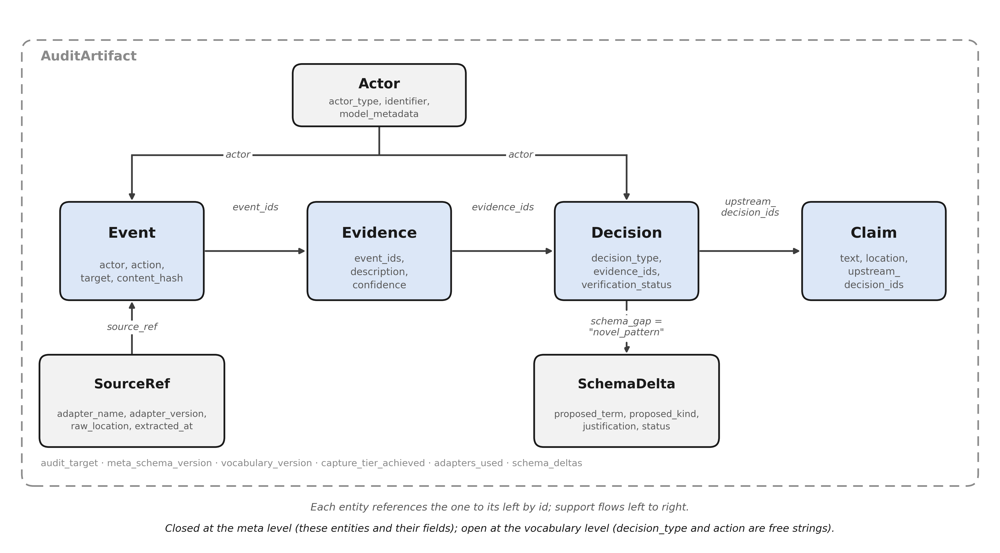
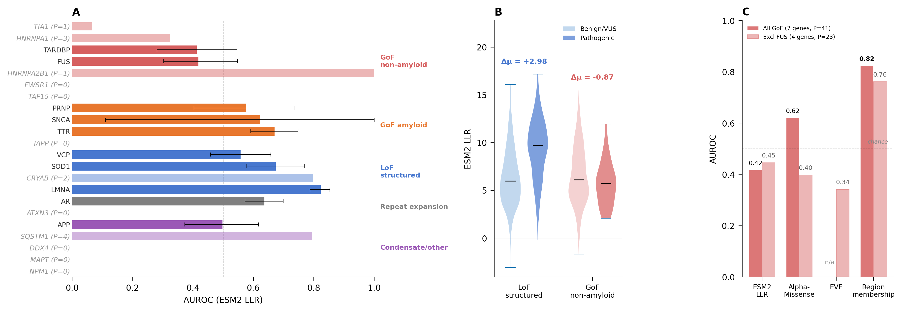

# Auditing AI-Assisted Research: The VAR Framework and AIVS Schema

**Authors:** Hannah Ribbeck and Boggavarapu Kiran*

Department of Chemistry and Physics, McNeese State University, Lake Charles, LA 70609, USA

**Corresponding author:** *Boggavarapu Kiran (kiran@mcneese.edu)

**ORCID iDs:** Boggavarapu Kiran, 0000-0003-0751-6459; Hannah Ribbeck, 0009-0005-3084-5607

---

## Abstract

Generative AI now drafts text, writes analysis code, and generates figures across computational science, yet the published record offers no standard way to document how it shaped a result. Disclosure reports that AI was used; it does not let a reader check what AI produced or whether anyone verified it. We frame the requirements for AI-assisted research as three checkable properties (verifiability, accountability, and reproducibility; VAR) and present AIVS, an open-source schema that records an AI-assisted workflow as an auditable artifact, extending the minimum-information-standard tradition to the system of tools generative AI introduces. We demonstrate it as a retrospective audit of a complete protein-variant pipeline built on six AI-derived predictors across 3,409 ClinVar variants, where it caught five classes of error, from fabricated model features to leaked cross-validation labels, that disclosure-only review would have missed. The schema and all data and code are openly deposited.

**Index Terms:** AI-assisted research, research reproducibility, scientific workflows, provenance, verification, generative AI, scholarly communication, protein variant prediction

---

## 1. Introduction

Generative AI is now embedded in computational science. Protein language models supply variant features, code assistants write analysis pipelines, and large language models draft prose, citations, and figure code. These tools shorten the path from question to result; they also introduce a class of failures the published record is not equipped to detect. Models fabricate citations to papers that were never written [2], generate plausible numerical claims that trace to nothing, and produce code that runs against unit tests but fails silently on real edge cases. AI-generated figures have been retracted from peer-reviewed venues. None of these is captured by a disclosure statement.

The gap between AI use and AI verification is now quantitatively documented. A failure-mode taxonomy of NeurIPS 2025 identified 100 hallucinated references across 53 accepted papers that had each cleared three-to-five-reviewer expert scrutiny [11]. The SPOT benchmark of 83 published papers paired with 91 errata-level errors found that state-of-the-art LLMs detect such errors at 6.1% precision and 21.1% recall [3]. These outputs are entering the published record now: end-to-end agentic platforms (Co-Scientist [7], Robin [8], Kosmos [9], the AI Scientist [10]) compose hundreds of generative invocations into single research artifacts, and the first AI-generated paper has already passed peer review at an ICLR workshop [10].

Funder policy has responded with blanket restrictions [1] and publisher screening tools, but these target ethics-policy breaches and fraud, not a workflow-level account of how AI shaped a specific result. What is missing is a documentation layer between disclosure and full workflow capture, one a reader can audit after the fact, even when the workflow was not instrumented in advance. We propose three properties such a record must make checkable (verifiability, accountability, reproducibility; VAR), present AIVS, an open-source schema that implements them as an auditable artifact, and demonstrate the method on a complete protein-variant pipeline built on six AI-derived predictors. The remainder of the article defines VAR (§2), specifies the AIVS schema (§3), and reports the case study (§4) in which AIVS-VAR caught five categories of failure during retrospective audit of a workflow we conducted ourselves.

---

## 2. The VAR Framework

VAR names three properties a verification record for AI-assisted research must make checkable: that every claim and citation resolves to a real object (verifiability), that a specific human is on record for each consequential decision (accountability), and that the workflow can be independently rerun (reproducibility). The properties are operational rather than aspirational: each translates into a check a reader, editor, or downstream researcher can perform on the deposited record without re-reading the paper.

**Verifiability** is checkable. Citations can be resolved against CrossRef, PubMed, arXiv, and institutional repositories; partial matches are flagged separately from non-resolutions. Quoted passages can be resolved against the cited source. Numerical claims can be resolved against canonical output files in the deposited bundle. Code can be cloned and smoke-tested against the pinned environment. Image provenance can be scored with existing forensic tools. Each check is mechanical and, in principle, automatable. AIVS (§3) records the outcome of each such check as part of the workflow's audit trail.

**Accountability** in VAR is author-side and record-based: it documents which human certified each AI-assisted decision. It is not a system that adjudicates reviewers or editors. The granularity required is the consequential workflow decision (a model and version selection, a dataset curation choice, a numerical result that enters the manuscript) paired with the identifier of the human who endorsed it. The schema records this identifier alongside the AI invocation that produced the underlying material, so that a deferred check (a year later, by a downstream researcher) can identify both the artifact and the responsible party.

**Reproducibility** requires that the workflow can be re-executed from deposited inputs. In practice this is the conjunction of three deposits: the data (with a content hash so future versions are distinguishable), the code (with an environment manifest), and the AI model (with version, sampling parameters, and the provider's stated retention policy at the time of access). Generative AI complicates the last of these: model behavior changes silently as providers retire weights and update routing, so the schema records the parameters that pin behavior at access date rather than asserting behavior at recompute time.

These three properties are not independent. A verifiability check requires accountability for the verifier; an accountability claim requires verifiable artifacts to anchor; a reproducibility deposit fails its purpose if neither verifier nor accountable author is recorded. AIVS treats them as the three views of a single audit record and serializes them together.

---

## 3. AIVS: A Verification Schema for AI-Assisted Research

Generative AI is a system of tools, not a tool. A single article can route through a protein language model, two pathogenicity predictors, a code assistant for analysis scripts, a chat assistant for draft prose and figure code, and an agent that coordinates several of these, each with its own version, retention policy, and failure modes. The minimum-information-standard tradition (MIAME, MIQE, ARRIVE) addresses single-instrument reporting; the schema needed here extends that tradition to the multi-tool system that generative AI introduces. AIVS is that schema: a closed meta-schema of five record types that captures the generate-evaluate-iterate-curate-deposit loop common to AI-assisted workflows.

### 3.1 Record types

AIVS records are organized by workflow stage. **Source** records anchor inputs: a Source carries a content hash, a URI, a retrieval timestamp, and a license. **Invocation** records describe each call to a generative tool: an Invocation carries an identifier, an optional parent_invocation_id linking it to a predecessor in an iteration chain, the tool, the model, the model version or weights hash, the prompt, sampling parameters (temperature, top-p, seed, max-tokens), the response, the operator's identifier, an access timestamp, the provider's stated retention policy at access date, and a purpose annotation. The graph of Invocation records is the iteration history of the workflow.

**Evaluation** records describe checks performed on Invocation outputs: a check type drawn from a controlled vocabulary (citation_resolution, quote_match, data_retrievability, code_execution, image_forensic, schema_validation), a target within the Invocation output, a result (pass, fail, or ambiguous, with a confidence value), the verifier (a human identifier for manual checks, a tool identifier for mechanical checks), and a URI to the supporting evidence. A single Invocation may carry many Evaluations performed by different verifiers using different check types. The Evaluation record is the explicit verification trail that V in VAR requires.

**Curation** records describe human selection from AI output: references to the source Invocations, a description of what was kept, a rationale, and the accountable author's identifier. The Curation record is the auditable trace from raw AI output to manuscript content: it answers which AI-generated material entered the paper and who decided to keep it.

**Deposition** records register the curated artifact in a public repository: artifact type, URI, repository, DOI, version, license, retention policy. Every record carries an accountable_author identifier. The graph rooted at Source records and terminating at Deposition records, with Curations drawing selectively from Invocations and Evaluations attached to Invocations, is the complete trail. AIVS records are its nodes (Fig 1).

### 3.2 Verification checks

AIVS does not perform verification; it records it. Each Evaluation record holds the outcome of a check performed on an Invocation's output. Some checks can be automated (citation resolution against CrossRef; numerical-claim resolution against canonical output files; code smoke tests against the deposited environment; image-forensic scoring) and some require human judgment (quote-context interpretation; appropriateness of a curated functional-region annotation). The schema is agnostic as to which, recording the verifier alongside each outcome.

The verification scope is intentionally bounded. AIVS does not assess the scientific correctness of claims, the appropriateness of methods, the novelty of contributions, or the quality of writing. These remain the responsibility of human reviewers. AIVS removes a category of failures from the reviewer's burden (citation hallucination, ungrounded quotation, irretrievable data, broken code, image fabrication, incomplete provenance) and leaves the remainder.

### 3.3 Privacy, disclosure tiers, and context

Several categories of legitimate work cannot disclose AI invocations in full at submission: prompts may carry unpublished data, patient-derived identifiers, third-party intellectual property, or material covered by IRB protocols. AIVS handles this through a tiered disclosure model. *Public* records are deposited in full alongside the manuscript; this is the default for non-sensitive work. *Editorial* records are deposited in full but accessible only to editors and assigned reviewers; the public bundle records the existence and rationale, not the content. *Redacted* records are deposited with sensitive content removed under a documented redaction methodology; the methodology itself is public. A floor of fields is always public regardless of tier: model identifiers, model versions, sampling parameters, verification results, and accountable-author identifiers. Provider-side retention is recorded as the provider's stated policy at the time of access, the only claim the author can supply truthfully.

The schema is versioned and append-only: a verification re-run against an updated database that newly resolves a previously failed citation is recorded as a new Evaluation, leaving the original outcome visible in the audit trail. AIVS is complementary to runtime provenance systems such as PROV-AGENT [12], which instrument agentic workflows through the Model Context Protocol and stream provenance into a consolidated database as the workflow executes: where such a system was in place, its records populate AIVS Invocation and Evaluation fields; where none was, AIVS is the schema an author uses to reconstruct an auditable record from the workflow's surviving artifacts. Interoperability with existing minimum-information standards is preserved (a CLAIM, TRIPOD-AI, or ARRIVE statement coexists in the same bundle as an AIVS record).

AIVS is released under AGPL-3.0-or-later at https://github.com/khatvangi/aivs and archived at Zenodo (10.5281/zenodo.20723559). The released version ships the meta-schema kernel, JSON serialization, structural-integrity validation, and four worked retrospective audit examples (the case study below plus three prior workflows). The automated checks of §3.2, an application-vocabulary serializer, and adapters for specific submission systems or agentic platforms are natural extensions but are not implemented here and are not claims of this paper; the schema is defined independently of any such tooling.

---

## 4. Case Study: An AI-Assisted Workflow on IDP Disease-Mechanism Prediction

We demonstrate AIVS-VAR on a workflow we conducted ourselves: prediction of disease mechanism from missense variants in intrinsically disordered protein (IDP) genes implicated in neurodegeneration. The workflow draws on six generative-AI-derived predictors, including a 650-million-parameter protein language model invoked across thousands of variant positions, and uses AI assistance for drafting, literature synthesis, and figure code. The audit was conducted retrospectively over the complete pipeline.

### 4.1 The research workflow

The biological question is whether conservation-based pathogenicity predictors handle missense variants in IDP-associated genes uniformly across disease mechanisms. The workflow integrates: (i) curation of a clean-labeled variant dataset of 3,409 variants across 22 genes from the ClinVar February 2026 snapshot; (ii) per-variant scoring with six predictors, namely ESM2 (esm2_t33_650M_UR50D) [4], AlphaMissense [5], EVE [6], CADD, REVEL, and PolyPhen-2, yielding log-likelihood ratios, position entropies, and predictor scores; (iii) leave-one-gene-out cross-validation of a two-step model combining curated functional-region annotations with the ESM2 log-likelihood ratio; (iv) mechanism-stratified evaluation against bootstrap and permutation controls; and (v) AI-assisted manuscript preparation, including literature synthesis, methods drafting, and figure generation under the verification protocol of §3.

The workflow maps onto the AIVS loop directly. Source records anchor the content-hashed ClinVar snapshot, UniProt canonical sequences, and functional-region annotations from primary literature. Invocation records cover each ESM2 inference call, each AlphaMissense and EVE lookup with access date and provider retention policy, each cross-validation fold, and each AI-assisted drafting session. Evaluation records cover AUROC computation, bootstrap confidence intervals over 1,000 resamples, a 10,000-permutation random-region control, mechanism-stratified subgroup AUROCs, and per-gene permutation tests. Curation records identify the canonical paper-facing outputs and explicitly mark exploratory analyses as superseded. Deposition records cover the figures, canonical CSV tables, analysis scripts, pinned ClinVar snapshot, environment manifest, and agent-session logs. The v0.1.0 deposit encodes the loop at workflow-decision granularity: three workflow Decisions (dataset curation, predictor selection, canonical-model selection) plus five failure-disposition Decisions (one per category below), each linked to Events citing implementing code, audit documents, and canonical CSV outputs.

### 4.2 What AIVS-VAR caught during workflow preparation

The case study is informative principally because AIVS was applied as a retrospective audit over a genuine end-to-end workflow, looking back across the analysis and the draft to record what materially affected the reported result. The audit caught five categories of failure that would have entered the literature under disclosure-only review. Each is documented as an Evaluation record in the AIVS bundle and corrected in the canonical outputs.

**Fabricated default features from a context-window violation.** The HTT locus encodes a 3,142-residue protein. ESM2's 1,022-token context window is exceeded by HTT sequences, and the inference wrapper in an early analysis script silently returned default-valued features (llr = 0.0, entropy = 0.0, rank = 10) for variants whose surrounding context could not be tiled within the window. 170 of 259 HTT variants (65.6%) received these fabricated defaults and were initially included in pooled AUROC computations. A manual data-retrievability audit on the variant feature table, checking for identical default-value patterns across consecutive variant positions (a signature of fabricated rather than computed features), flagged the HTT rows. The flag and its disposition are recorded as a kernel-level Decision in the AIVS bundle, linked to Events citing the offending script lines, the audit document (`docs/2026-02-20-audit-code-science-logic.md`, finding 3), and the corrected canonical output. The locus was excluded from all paper-facing analyses, yielding the 3,409-variant 22-gene evaluable set.

**Silently biased AUROC from skipped LOGO-CV folds.** Scripts 04 and 06, early implementations of the cross-validation pipeline, zero-initialized prediction arrays at the start of each fold and overwrote only the folds where both classes were present. Folds skipped for insufficient class diversity left zero-initialized entries in the prediction array, which were then included in pooled AUROC computation. The bias was small for the clean-label set but non-negligible for mechanism-stratified subsets where some folds had no benign variants. A manual code-execution audit compared the outputs of script 04, the intermediate exploratory ensemble script 08, and the audit-verified script 10 against the canonical bootstrap CI file; the gap between script 04 outputs and the bootstrap distribution surfaced the array-initialization defect. The flag is recorded as a kernel-level Decision in the AIVS bundle, linked to Events citing script lines, the audit document (findings 5 and 2), and the corrected canonical output. Scripts 04 and 06 are marked superseded; the canonical paper-facing predictor is script 10.

**Oracle leakage in the mechanism-aware ensemble.** Script 08 implemented a mechanism-aware ensemble that routed predictions through different sub-models depending on the disease mechanism of the held-out gene. The routing decision required the true mechanism label of the test gene, making the reported 0.738 AUROC unachievable in a prospective setting. A manual review of the routing function's test-time inputs detected access to a `mechanism` field that should have been blinded under LOGO-CV. The flag is recorded as a kernel-level Decision in the AIVS bundle, linked to Events citing the routing-function lines (finding 4 of the audit document) and the corrected canonical model. The ensemble was demoted to exploratory status and explicitly excluded from the manuscript's headline claims. The two-step predictor of script 10, which uses curated region annotations rather than mechanism labels and respects LOGO-CV blinding, is the canonical model.

**Numerical claims that did not match the canonical outputs.** The Methods and Results sections of the manuscript drafts contained several numerical values that did not trace to the canonical CSV outputs when audited. Three are representative. First, the pooled clean-label ESM2 AUROC was initially reported as 0.70 in §1; this was the VUS-included value. Trace against `bootstrap_cis.csv` corrected it to 0.772. Second, an early draft of §5 cited two-step AUROC = 0.784 against ESM2 = 0.676; both values came from the VUS-included set, and the 0.784 was generated by a five-feature model (`membership_plus_llr_plus_features`), not the two-feature two-step model described in the section text. Trace against `results_two_step.csv` corrected the section to lead with clean-label 0.873 (vs 0.748) and disclose VUS-included 0.766 (vs 0.676) as explicit sensitivity. Third, LoF-structured performance was misreported as "comparable at 0.76 for both methods"; the actual clean-label values are ESM2 = 0.813 and two-step = 0.650, a degradation. This too was caught by canonical-CSV trace and is now disclosed honestly in §5 of the manuscript and in the mechanism-split table.

**Statistical claims that could not be made.** An early draft reported "P(two-step > ESM2) = 1.000" from 1,000 bootstrap resamples. Probabilities below 1/n_bootstrap cannot be estimated from a finite resample; the maximum reportable value from 1,000 resamples is 0.999. A manual statistical-claim-type audit flagged the impossible value (`CRITICAL_EVALUATION.md` §3.3); the flag is recorded as a kernel-level Decision in the AIVS bundle. Corrected to P < 0.001.

Beyond these five, the same manual audit chain caught minor methods-section drift (Table S3 cited IUPred2A for the disorder predictor used; the actual predictor was metapredict, and the local-composition window was ±15 residues, not ±10), bootstrap-resample failures for genes with too few minority-class variants, and inadequate disclosure of class imbalance at the per-gene level. Each is now disclosed in the manuscript with severity and downstream consequence, and recorded in the AIVS bundle.

### 4.3 The AIVS-VAR record for the case study

*Verifiability.* Every quantitative claim traces to a specific cell in a canonical output file. The numerical-audit log in `CRITICAL_EVALUATION.md` records ten headline numbers with their source CSV references and verification outcomes. Citation resolution against CrossRef and PubMed succeeded for all references in the current draft. Each figure caption carries a generation-script reference and a canonical-input-CSV reference.

*Accountability.* Authorship is disclosed at the granularity of section and task. The IDP workflow (variant curation, feature engineering, cross-validation, mechanism-stratified analysis, permutation controls) is attributed to H.R.; AIVS framework conception, schema design, AI-assisted drafting, and figure preparation are attributed to B.K. Each Event and Decision carries an Actor record identifying the accountable author by ORCID. The agent-session logs (bulk-referenced by byte-size and session-id and deposited under access control) provide the operator's invocation history.

*Reproducibility.* The full pipeline is deposited at https://github.com/khatvangi/idp-mechanism-classifier (Zenodo DOI 10.5281/zenodo.20723561). The ClinVar snapshot is pinned to February 2026 with a content hash. The ESM2 model is pinned to `esm2_t33_650M_UR50D`; AlphaMissense and EVE access dates and provider retention policies are recorded per Invocation. Recomputation from the deposited inputs was tested on 2026-03-16 and reproduces every headline AUROC to three decimal places.

### 4.4 Results under verification

The verified scientific findings are these. Clean-label overall AUROC: ESM2 = 0.748; region membership alone = 0.792; two-step (region + ESM2) = 0.873. Mechanism-stratified ESM2 AUROCs separate cleanly: loss-of-function structured (LMNA, SOD1, CRYAB, VCP) = 0.813; toxic-aggregation amyloid (SNCA, TTR, PRNP, IAPP) = 0.813; gain-of-toxic-function non-amyloid (FUS, TARDBP, HNRNPA1, TIA1, HNRNPA2B1, EWSR1, TAF15) = 0.493, essentially chance (Fig 2). The two-step predictor rescues the non-amyloid subset to AUROC = 0.822 (Δ = +0.329, bootstrap 95% CI [0.305, 0.441], P < 0.001) while modestly degrading the LoF structured subset to 0.650, a trade-off disclosed in the deposited record. Six-predictor convergence on the non-amyloid subset confirms the failure pattern across independent generative architectures: AlphaMissense AUROC = 0.620 (drops to 0.398 excluding FUS), EVE = 0.342, with non-generative baselines tracking similarly. The FUS NLS analysis carries the strongest individual case: NLS membership alone predicts FUS pathogenicity at AUROC = 0.916 (10,000-permutation random-region p = 0.002 against length-matched alternatives).

### 4.5 What the case demonstrates

The case study supports three claims about AIVS-VAR. First, the framework is constructible for genuine AI-integrated research at workflow-decision granularity, even when the workflow was not instrumented in advance. Second, it catches real failures that disclosure-only policies would miss: the five categories above are not hallucinated citations of the kind most often associated with AI-assisted drafting, but quieter technical defects that survive copy-editing, and each was caught by a specific AIVS check. Third, the verification investment is concentrated at predictable workflow points and scales sub-linearly with manuscript complexity: the failures were caught during targeted audit work, not line-by-line re-reading.

The case also exposes what AIVS-VAR cannot certify. The framework records that the FUS PY-NLS is annotated as residues 502–526 with reference to Dormann et al. 2010 and that a 10,000-permutation control yielded p = 0.002 for this annotation; it does not certify that 502–526 is the correct boundary. AIVS-VAR makes the verification chain visible at every step; it does not replace the chain.

### Figures

**Figure 1. AIVS record graph.** Directed graph rooted at Source records (workflow inputs: data, model checkpoints, prior literature) and terminating at Deposition records (the public artifact). Invocations chain via `parent_invocation_id` to encode iteration; Evaluations attach to Invocations and carry the verification outcome under a controlled check-type vocabulary; Curations select from one or more Invocations and identify the accountable author. Every node carries an accountable-author identifier. The schema is closed at the meta-level (these five record types) but open at the vocabulary level (the check_type and decision_type strings evolve with the empirical audit corpus).

**Figure 2. Conservation-based pathogenicity prediction is mechanism-dependent.** (A) Per-gene ESM2 LLR AUROC for 22 genes, organized by disease mechanism. Horizontal bars show point estimates; error bars show bootstrap 95% CIs. Dashed vertical line marks AUROC = 0.50 (chance). GoF non-amyloid genes (red) fall below chance; LoF structured genes (blue) cluster above 0.65. (B) Violin plots of ESM2 LLR distributions for benign/VUS (light) and pathogenic (dark) variants in LoF structured (left) and GoF non-amyloid (right) groups. Δμ = +2.98 for LoF structured (pathogenic variants have higher conservation scores); Δμ = −0.87 for GoF non-amyloid (pathogenic variants have lower scores). (C) AUROC comparison across four predictors for GoF non-amyloid genes: ESM2 LLR, AlphaMissense, EVE, and binary functional region membership. Region membership (0.82) outperforms all three conservation-based predictors. EVE was unavailable for FUS.

---

## 5. Discussion

The contribution is a documentation layer between disclosure and full workflow capture. Disclosure-without-verification leaves fabrications to enter print unless a reviewer happens to notice; an AIVS record makes the verification of each AI-assisted claim explicit and inspectable, so that a missed check is visible in the audit trail rather than invisible. The contribution is the layer itself, not an enforcement mechanism: whether and how venues require or automate such records is a question of editorial policy and infrastructure beyond the scope of a single paper. What this paper establishes is that the record is constructible for a genuine AI-integrated workflow, and that constructing it caught errors disclosure would not.

The argument matters most for the agentic-platform case. Co-Scientist orchestrates six specialized agents into a tournament-evolved hypothesis pipeline that has produced drug-repurposing candidates with subsequent wet-lab validation [7]. Robin produced, end-to-end, a *Nature*-published claim on ROCK inhibitor activity in retinal pigment epithelium phagocytosis [8]. Kosmos runs twelve-hour autonomous campaigns executing ~42,000 lines of code per run [9]. The AI Scientist produced the first AI-generated paper accepted through peer review at an ICLR workshop [10]. These platforms emit internal logs; those logs could be mapped to AIVS Invocation, Evaluation, and Curation records, so that a paper produced by an agentic platform carries an auditable record of its internal steps rather than a single disclosure line, and readers gain a verification trail that survives independent of the platform vendor's commercial trajectory. The mapping tooling is not built here; the point is that the schema is expressive enough to represent these workflows at the granularity at which they fail.

The framework has a reach limitation. As demonstrated here it is an author-side practice: it produces an auditable record, but it depends on authors choosing to produce one and on readers and reviewers choosing to inspect it. Whether venues require or automate such records is an editorial-policy question this paper does not address. What this paper does address is whether the record itself is constructible and useful, and the case study answers both.

---

## 6. Conclusion

The pertinent question is not whether AI use should be permitted but how AI-assisted work can be documented to a standard that science can defend. The VAR properties (verifiability, accountability, reproducibility) define what that documentation must make auditable; the AIVS schema records it; the IDP case study demonstrates the record is constructible for a genuine workflow and that constructing it caught errors disclosure would not. As agentic platforms scale, the gap between their internal sophistication and the external auditability of their published outputs widens, and a schema that can represent their internal steps at the granularity at which they fail is the missing record. The alternative, a literature in which fabricated and genuine content cannot be reliably distinguished, is not a stable equilibrium for a discipline that depends on shared trust in its literature.

---

## Experimental procedures

The case-study workflow is summarized here for reproducibility; per-step provenance is recorded in the deposited AIVS bundle. **Dataset:** 3,409 missense variants across 22 IDP-associated genes from the ClinVar February 2026 snapshot (content-hashed) at ≥1-star review status, cross-validated against UniProt canonical sequences. **Predictors:** ESM2 (esm2_t33_650M_UR50D) supplying log-likelihood ratios and position entropies; AlphaMissense and EVE for variant pathogenicity scores; CADD, REVEL, PolyPhen-2 as non-generative baselines. Functional-region annotations from primary sources (FUS PY-NLS 502–526; TARDBP LCD 274–414; HNRNPA1 PrLD 185–372). **Model:** two-step logistic regression combining a binary curated-region-membership indicator with the raw ESM2 LLR. **Evaluation:** leave-one-gene-out cross-validation with deterministic folds; 1,000-resample bootstrap CIs; 10,000-permutation random-region control; mechanism-stratified subgroup AUROCs; per-gene permutation tests. The environment is pinned in `requirements_kdense.txt`. **Verification:** the AIVS v0.1.0 schema was used to structure the verification record; the five failure categories of §4.2 were each caught by manual audit during retrospective preparation and recorded as kernel-level Decisions in the AIVS bundle, each linked to Events citing the offending code, audit document, and corrected canonical output.

---

## Resource availability

**Lead contact.** Requests for further information should be directed to Boggavarapu Kiran (kiran@mcneese.edu).

**Data and code availability.** The AIVS meta-schema (AGPL-3.0-or-later) is at https://github.com/khatvangi/aivs and archived at Zenodo: version DOI 10.5281/zenodo.20723559 (release tag v0.2.1-paper); concept DOI 10.5281/zenodo.20723558 resolves to the latest version. The variant dataset, analysis and figure-generation scripts, environment manifest, and AIVS verification record for this manuscript are at https://github.com/khatvangi/idp-mechanism-classifier and archived at Zenodo: version DOI 10.5281/zenodo.20723561; concept DOI 10.5281/zenodo.20723560. The large public source tables (ClinVar variant_summary, AlphaMissense substitutions) are re-downloadable and excluded from the deposit. This paper's own AIVS verification trail is provided in the supplemental information.

---

## References

[1] National Institutes of Health. Supporting fairness and originality in NIH research applications. NOT-OD-25-132. July 2025. https://grants.nih.gov/grants/guide/notice-files/NOT-OD-25-132.html

[2] Naser MZ. How LLMs cite and why it matters: a cross-model audit of reference fabrication in AI-assisted academic writing and methods to detect phantom citations. arXiv:2603.03299, February 2026.

[3] Son G, Hong S, Choi H, et al. When AI Co-Scientists Fail: SPOT — a Benchmark for Automated Verification of Scientific Research. arXiv:2505.11855, May 2025.

[4] Lin Z, Akin H, Rao R, et al. Evolutionary-scale prediction of atomic-level protein structure with a language model. *Science* 2023;379:1123–1130.

[5] Cheng J, Novati G, Pan J, et al. Accurate proteome-wide missense variant effect prediction with AlphaMissense. *Science* 2023;381:eadg7492.

[6] Frazer J, Notin P, Dias M, et al. Disease variant prediction with deep generative models of evolutionary data. *Nature* 2021;599:91–95.

[7] Gottweis J, Weng W-H, Daryin A, et al. Towards an AI co-scientist. arXiv:2502.18864, February 2025. Subsequently published as: Gottweis J, Natarajan V, et al. An AI co-scientist for biomedical research. *Nature* 2026 (in press).

[8] Ghareeb AE, Chang B, Mitchener L, et al. Robin: a multi-agent AI system for autonomous scientific discovery. *Nature* 2025 (FutureHouse). Preprint: futurehouse.org/research-announcements/demonstrating-end-to-end-scientific-discovery-with-robin.

[9] Edison Scientific. Kosmos: an AI scientist for autonomous discovery. arXiv:2511.02824, November 2025.

[10] Yamada Y, Lange RT, Lu C, et al. The AI Scientist-v2: workshop-level automated scientific discovery via agentic tree search. arXiv:2504.08066, April 2025. Subsequently published as: Lu C, Lu C, Lange RT, Foerster J, Clune J, Ha D. The AI Scientist: towards fully automated open-ended scientific discovery. *Nature* 2026 (in press).

[11] Ansari S. Compound deception in elite peer review: a failure-mode taxonomy of 100 fabricated citations at NeurIPS 2025. arXiv:2602.05930, February 2026.

[12] Souza R, Gueroudji A, DeWitt S, et al. PROV-AGENT: unified provenance for tracking AI agent interactions in agentic workflows. In: Proceedings of the 2025 IEEE 21st International Conference on e-Science (e-Science), Chicago, IL, USA, 2025. arXiv:2508.02866.

---

**Author contributions:** Conceptualization, B.K.; Methodology, B.K. and H.R.; Software, B.K.; Investigation, H.R.; Data curation, H.R.; Formal analysis, H.R.; Writing – original draft, B.K.; Writing – review & editing, B.K. and H.R.

**Declaration of interests:** The authors declare no competing interests.

**Acknowledgments:** This work was supported by internal funds from McNeese State University; no external funding was received.

**Generative AI use:** Consistent with the framework introduced in this article, AI-assisted contributions to the manuscript and the case-study workflow are recorded as Invocation, Evaluation, and Curation records in the deposited AIVS bundle (https://github.com/khatvangi/idp-mechanism-classifier; Zenodo DOI 10.5281/zenodo.20723561). AI assistance was used for literature synthesis, methods drafting, figure-code generation, and per-variant scoring with the generative protein language model ESM2 and the generative variant predictors AlphaMissense and EVE; each session and inference call is logged with model, version, access date, and provider-stated retention policy.

**Author biographies:**

**Hannah Ribbeck** is an undergraduate researcher in the Department of Chemistry and Physics at McNeese State University, working on computational biology of intrinsically disordered proteins and variant interpretation.

**Boggavarapu Kiran** is on the faculty of the Department of Chemistry and Physics at McNeese State University. His research interests span computational biology, the philosophy and methodology of AI-assisted research, and scientific publishing infrastructure. He received a Ph.D. in chemistry. Contact: kiran@mcneese.edu.
